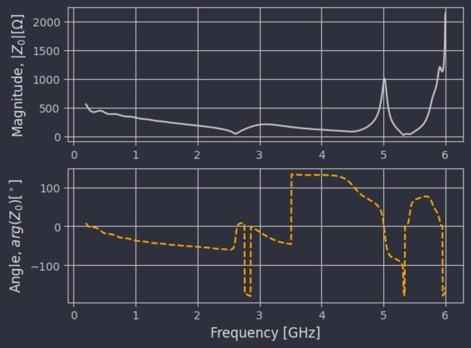
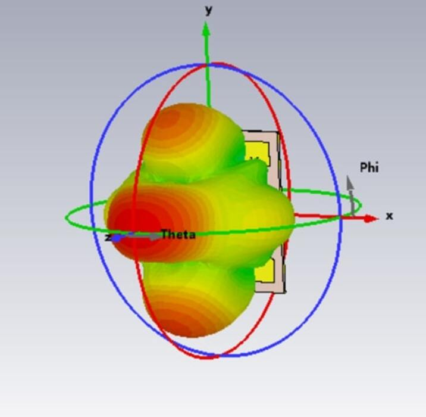
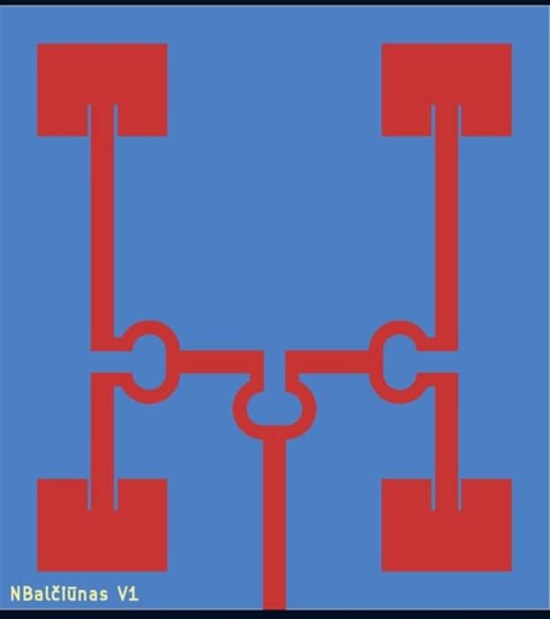
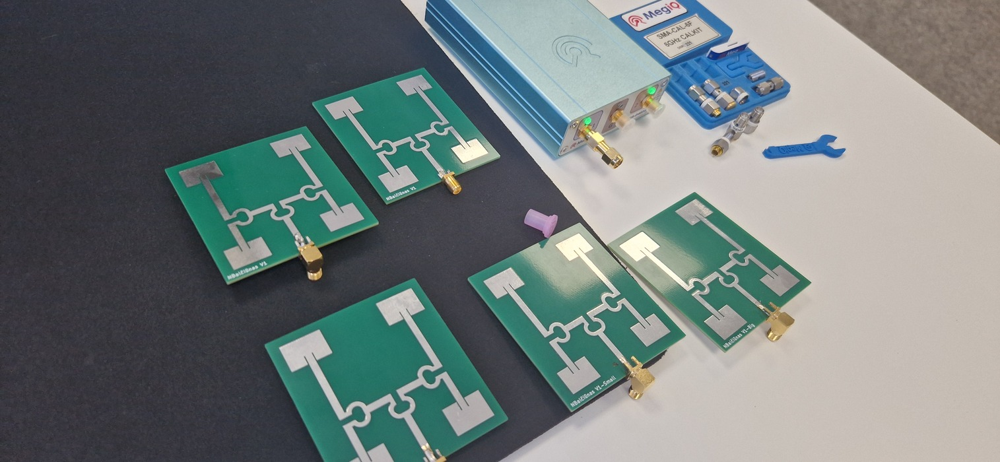

| Year |  Status   |
| :--: | :-------: |
| 2025 | Completed |

## Science summer

This summer I had the chance to do a Research Council of Lithuania internship in the field of electronic engineering.
It was quite challenging, but also very eye-opening to the RF world, as I worked on designing, simulating, and testing a directional phased array antenna for drone video transmission in the 5.8 GHz band.

## Challenges

Working with RF is kind of like working with magic.
A very tiny difference in dimensions can make the antenna resonate in a completely different band.
Because of this sensitivity I needed a proper program to simulate the antennas I had designed.
At first, I tried openEMS combined with gerber2ems which did not work properly for me.
It gave rubbish results.
After finding CST Studio Suite, it started going much smoother and I could get proper results.
Still I needed to use the education version of CST Studio Suite, therefore there were still practical limits, that were a bit annoying.
I could not simulate the whole antenna seamlessly, because of its size.
Furthermore, I could not export it to manufacturing format and had to redraw it in KiCad.

## RF components

The antenna that I have designed is a microstrip patch array antenna.
I chose micro-strip because it was perfect for a PCB antenna and one of the criteria was to keep the antenna cheap.
Because it was an antenna array I needed to split the one signal into four equal signals.
To do that I used three Wilkinson power dividers.
Lastly, because in my antenna two patches were upside down, and this affects the antennas radiation, I needed to shift the phases.
The simplest way to do this, was to make the feed length of those two antennas longer.
One thing that weighed down the antennas was that because of the time constraints I did not optimize them as well as I could have.

## Production

As I have mentioned before because CST Studio Suite educational edition does not support exports, I had to redraw the antennas in KiCad to make manufacturing files.
I used JLCPCB to manufacture the antennas with barely changing the norms of the manufacturing settings.
I also ordered not only the base antenna, but also three different designs.
One with 5% bigger patches, one with 5% smaller patches and one with PCB solder mask not removed.

## Testing

When the antennas arrived I tested them with VNA-0460E vector network analyzer.
From the testing I saw that the closest to the 5.8 GHz band, was the antenna with the smaller patches.
I can proudly say that I have managed to do what I set out to do, which is to make a directional antenna array in the 5.8 GHz band.

## Pictures

  
  
  
  
  
  
  
  
  
  
  
  
  
  
  
  
  
  
  
  
  
  
  
  
  
  
  
  
  
  
  
  

