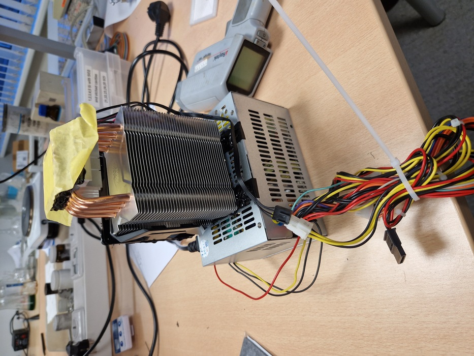
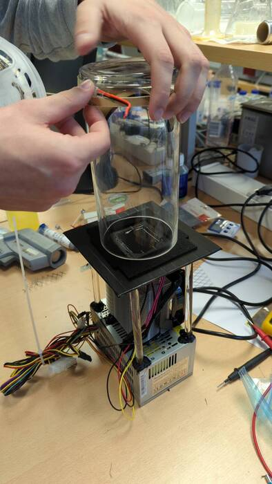
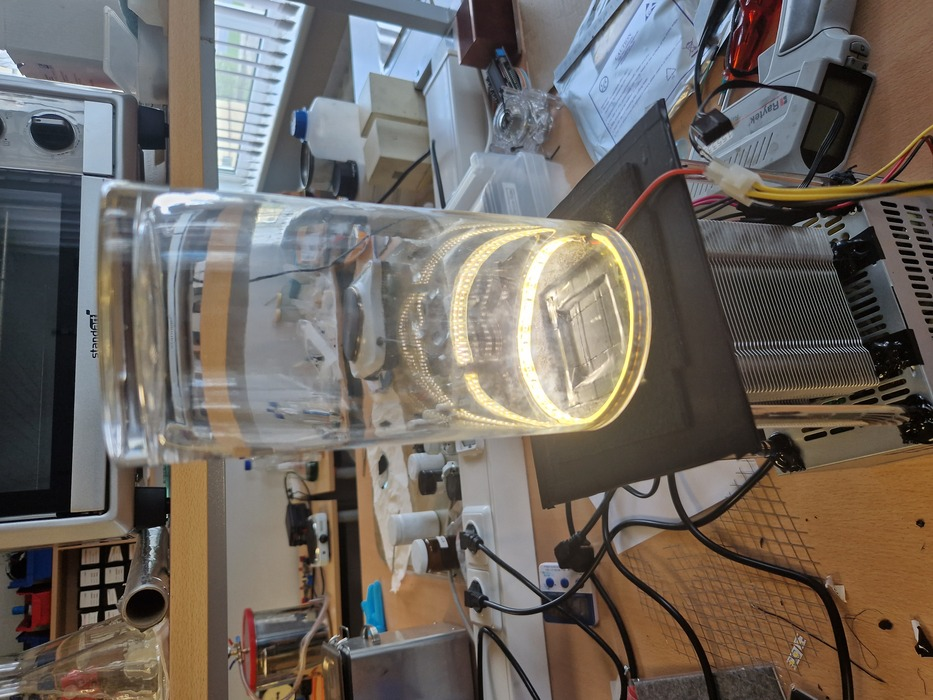
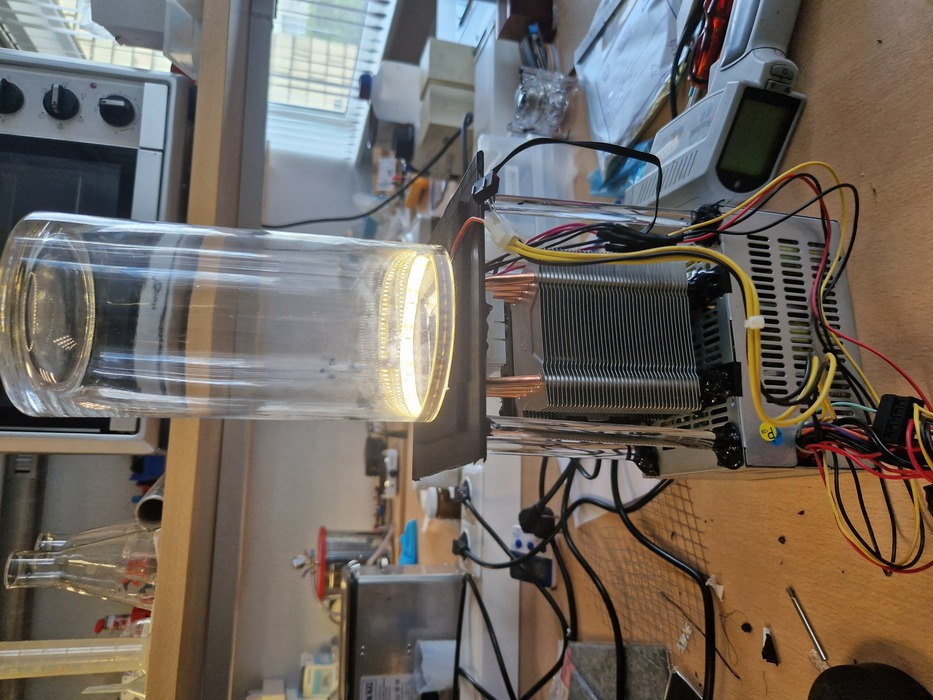
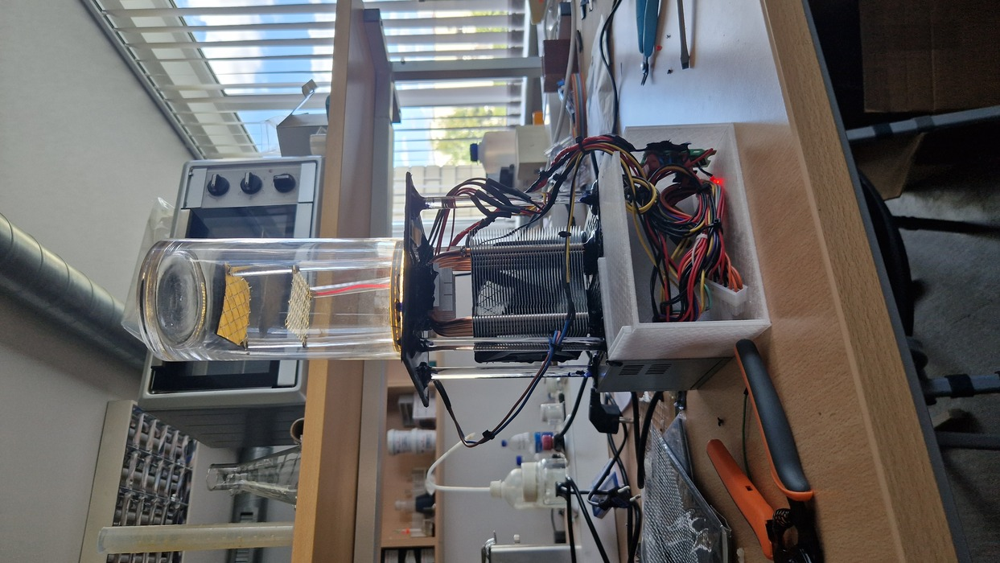
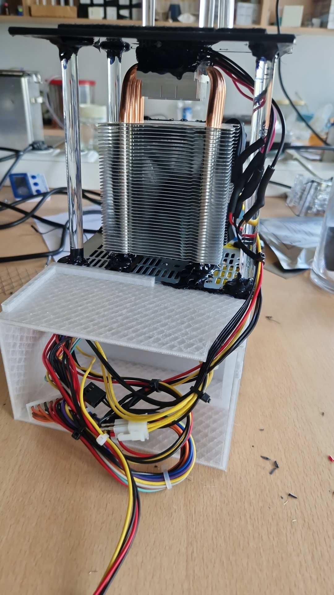
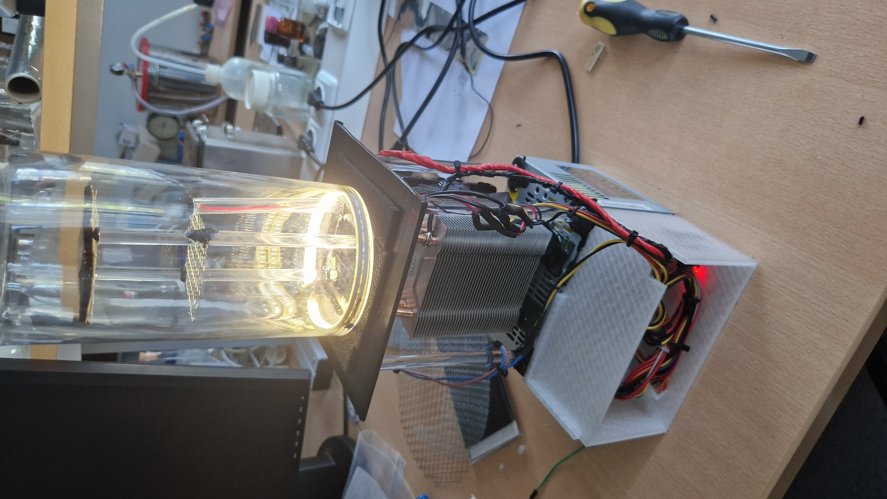
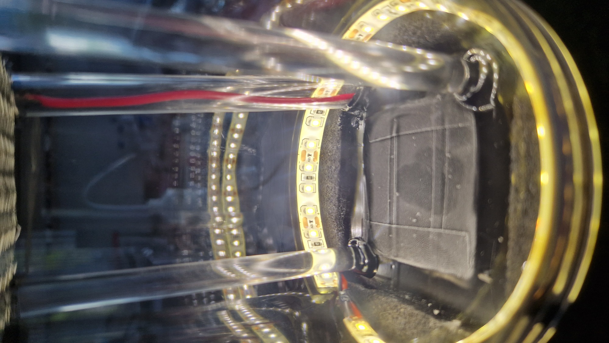

| Year |  Status   |
|:----:|:---------:|
| 2023 | Completed |

## The working principle

Many alpha, beta and gamma rays fly around us every day, but we don't see them.
Luckily, we can build a cloud chamber, that would help us see those particles.
When an alpha or beta ray pass through saturated alcohol vapor they leave ionization trails.
If we grossly oversimplify what a cloud chamber is we could say that it is an apparatus that maintains saturated alcohol vapor.
To do so first we need a cold surface, to get the alcohol vapour to condense when it touches it.
By using Peltier modules that when plugged in make one side very warm and the other very cold, we can create a cold surface.
I placed the hot side on the bottom and attached a CPU cooler to it to disperse the heat and by dispersing it allowing the top to be even colder.
Also on the cold side I added a copper plate to make the cold surface bigger.
Furthermore, I added a high voltage generator to create an electric field which helps to attract alpha and beta rays.
To make everything look more aesthetically pleasing, I cut out acrylic supports, put a black sticker on the cold surface and added an LED strip.
To prevent the vapour from escaping we add a vase on top of our cold surface.
Finally, I connected a power supply to power the fan on the CPU cooler, LEDs and high voltage generator.
Now we are finished with our cloud chamber that works very nicely.
To use it, we plug it in, pour some alcohol onto our cooled surface and wait.
After some time we should start seeing particles passing through the vapour.
This project was inspired by [The Thought Emporium's video](https://www.youtube.com/watch?v=-Cu3wW8rNAs).

## Pictures

<video width="400" height="auto" controls>
  <source src="/src/assets/images/cloud-chamber/1.mp4" type="video/mp4">
</video>

