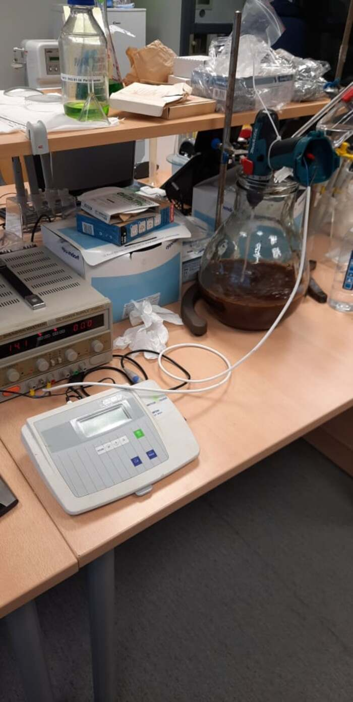
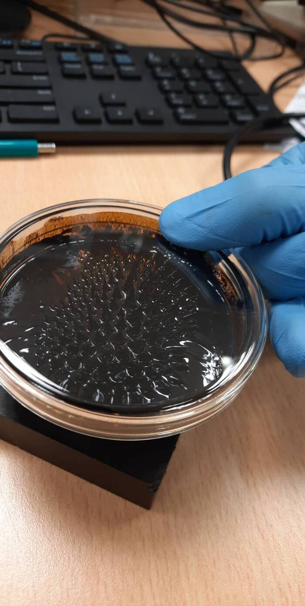
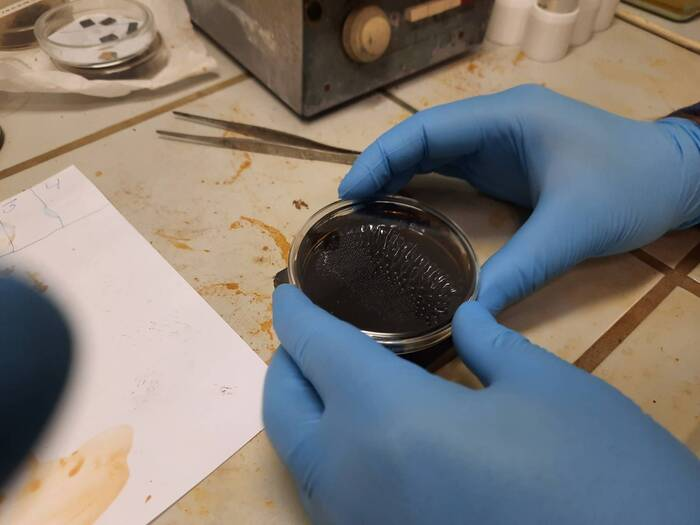
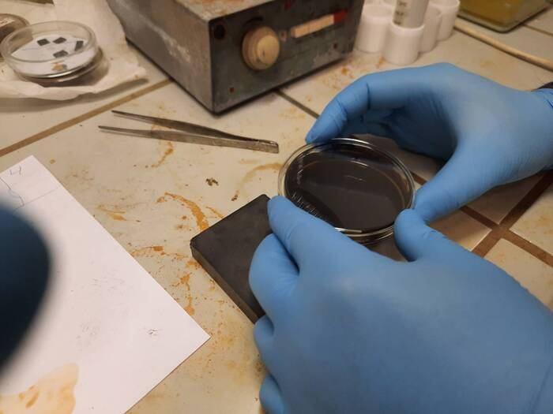
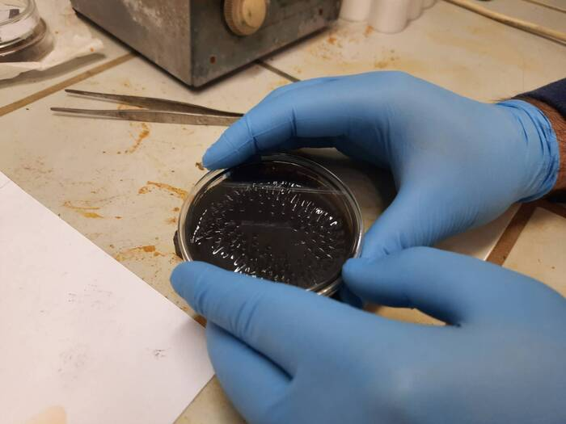
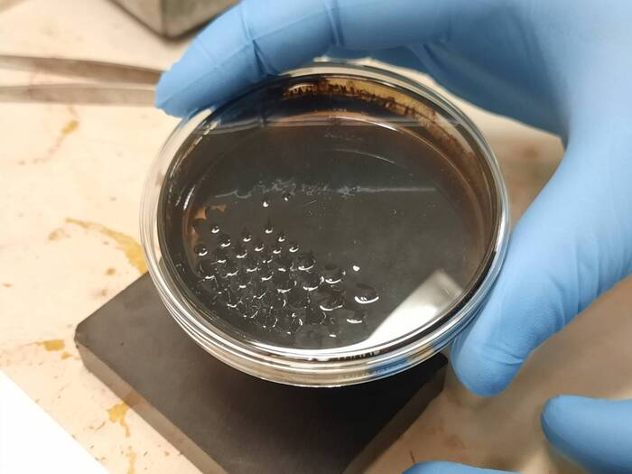
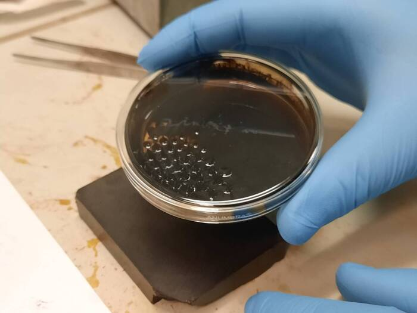
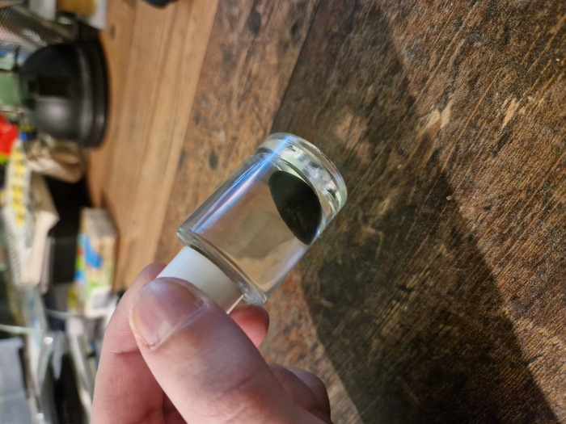
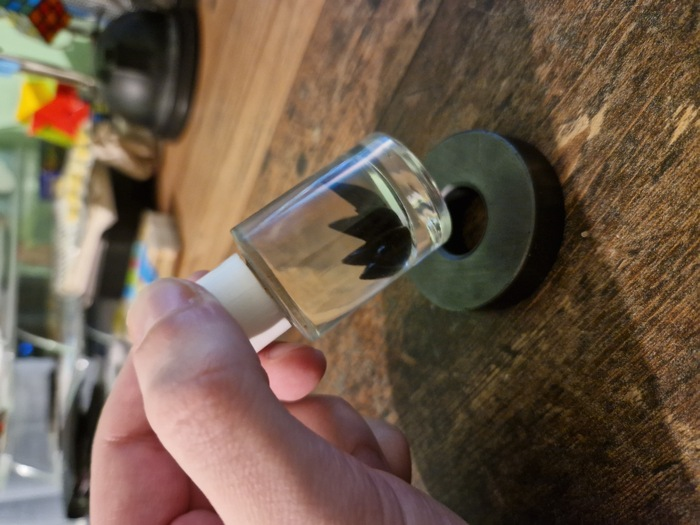

| Year |  Status   |
|:----:|:---------:|
| 2021 | Completed |

## Working with chemicals

This project was done trying to recreate the process shown in [NileRed's video](https://www.youtube.com/watch?v=6L8yUY-doNc).
I got to work a bit with a vacuum chamber and to work in a clean room.
It was my first project that is chemistry related.
Our setup was a bit sketchy tough, instead of the one presented in the video.
We used a drill as our mixer, and we controlled it with a bench power supply.
There was also a ph meter dipped in the solution to monitor the ph.
A lot of times the process failed, because of various reasons, but we got it to work in the end.

## The Pictures

