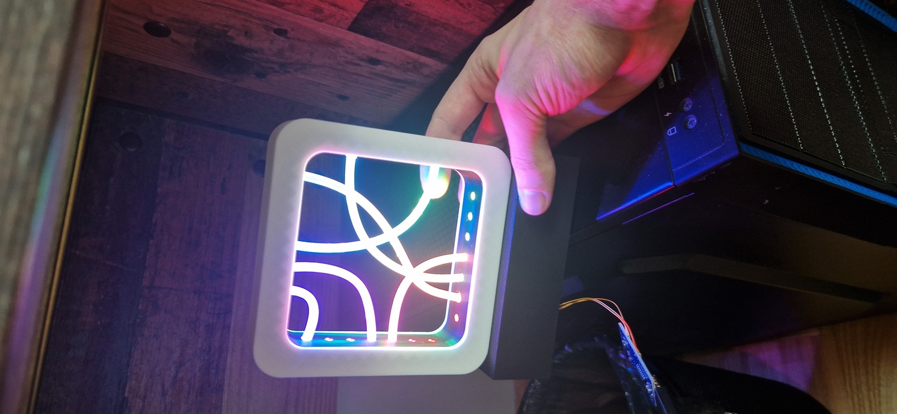

| Year |  Status   |
| :--: | :-------: |
| 2024 | Completed |

## Pretty glowing tubes

I saw someone make a lamp from fiber optic cables, and I was inspired to try to make it as well.
Since my mom's birthday was coming up I decided to make it for her.
For the main computing I used Arduino Nano. For the LEDs I chose the trusty neopixels.
Also, because I wanted the lamp to have several modes I also needed a button, and to power the lamp with a USB-C cable I added a USB-C port.
Picking out parts was easy, the hardest part was the frame itself, which I designed and 3D printed with my new 3D printer.
It came together quite nicely, though I did have to remodel the parts a few times.
Soldering LEDs and gluing the fiber optics cables was quite painstaking, but in the end it was worth it.
It has several lighting modes, some are just plain colors, others are animated, like a rainbow changing throughout the wheel.
The lamp ended up very pretty, and I'm very happy with the results.

## The Pictures

