| Year |  Status   |
|:----:|:---------:|
| 2023 | Completed |

## The story

I was interested in drones for a long time, but I was dissuaded by the price tag of this hobby to start building drones.
When I won a scholarship I decided to get into this hobby.
I didn't do a lot of things that were not seen before.
This hobby is well documented enough, so I won't elaborate into details.
I decided to make my drone use a 7-inch frame instead of the usual recommended 5-inch frame in hopes of it being more stable and maybe in the future capable of carrying something as part of another project.
Furthermore, I added a GPS module that aren't rare per se, but unusual to see on a freestyle drone.
Another thing to mention is that I used Eachine EV800D goggles which have a few problems, one of which is that sometimes they bug out, and you need to turn the battery off and on or wait for the battery to die.
To make it a little bit simpler to cut off the power from the battery I made a small modification and installed a toggle button to control whether the internal battery is connected or not.
I used betaflight software for programming the drone.
In the end the drone ended up being tons of fun, and I'm glad I picked up this hobby.

## Pictures

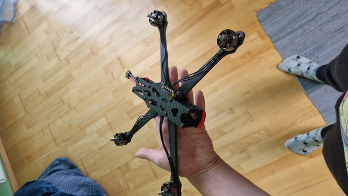
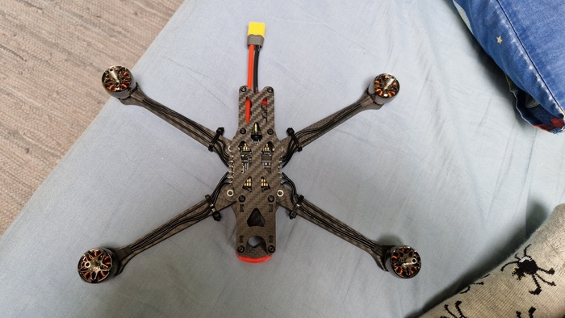
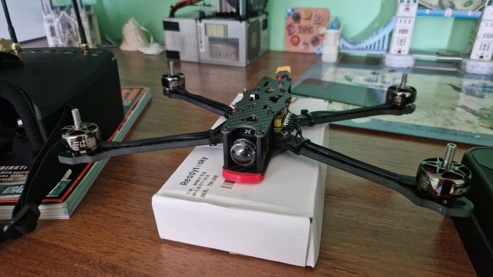
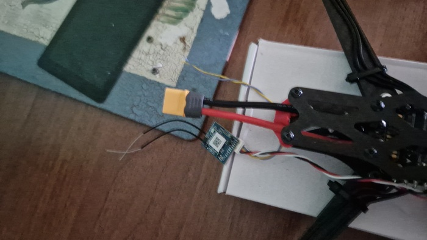
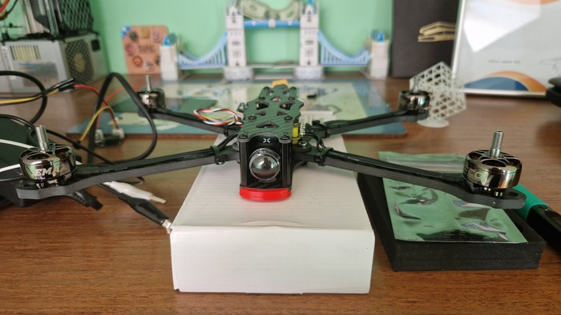
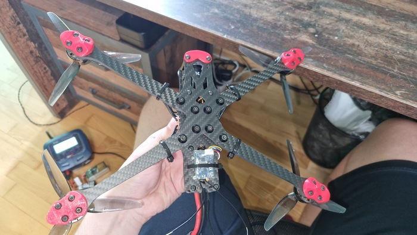
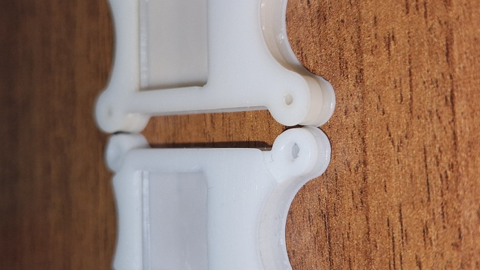
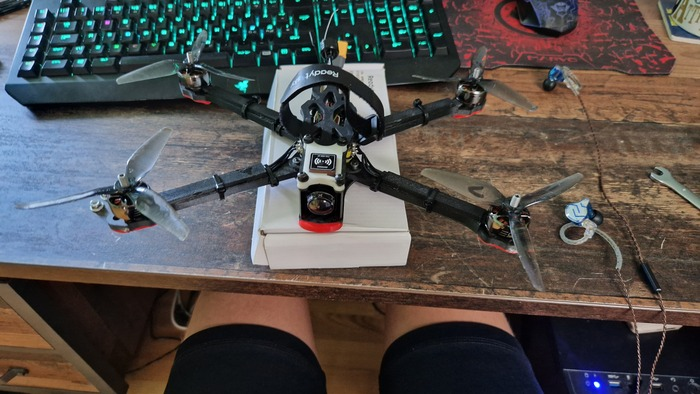
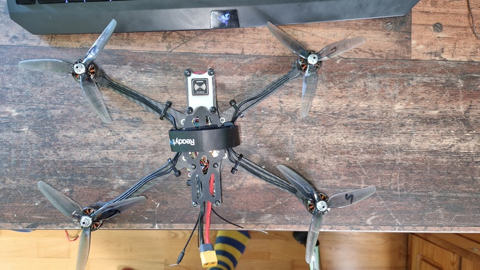
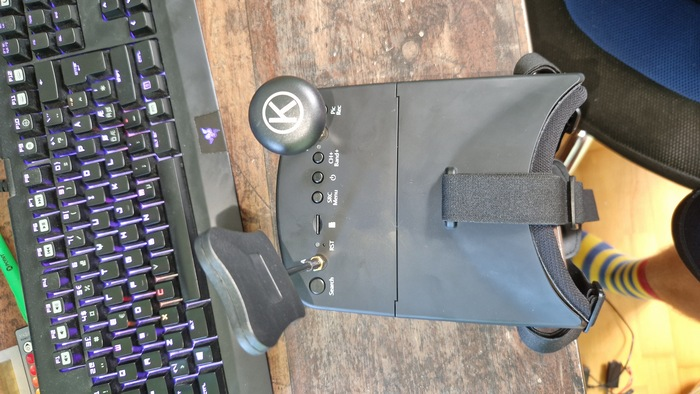
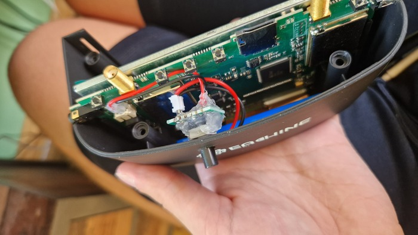
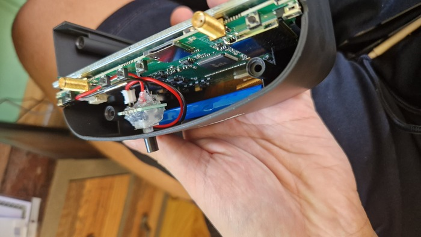
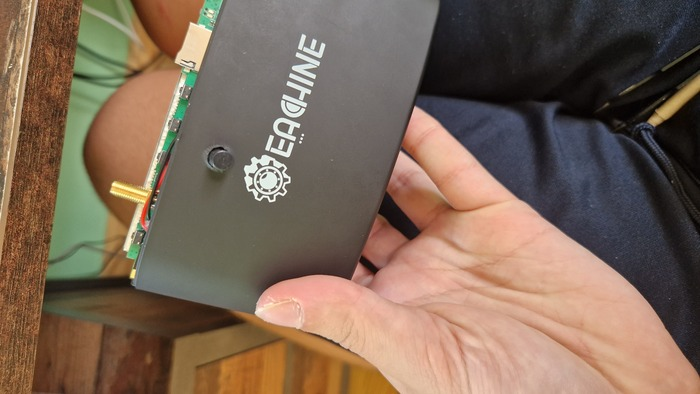
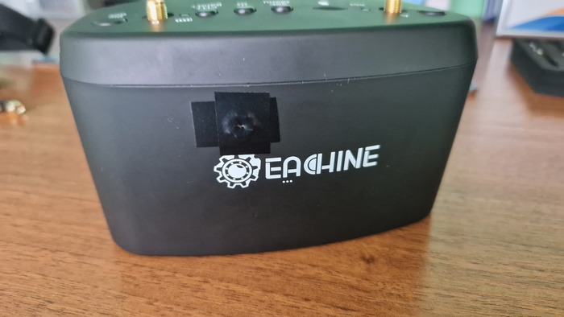
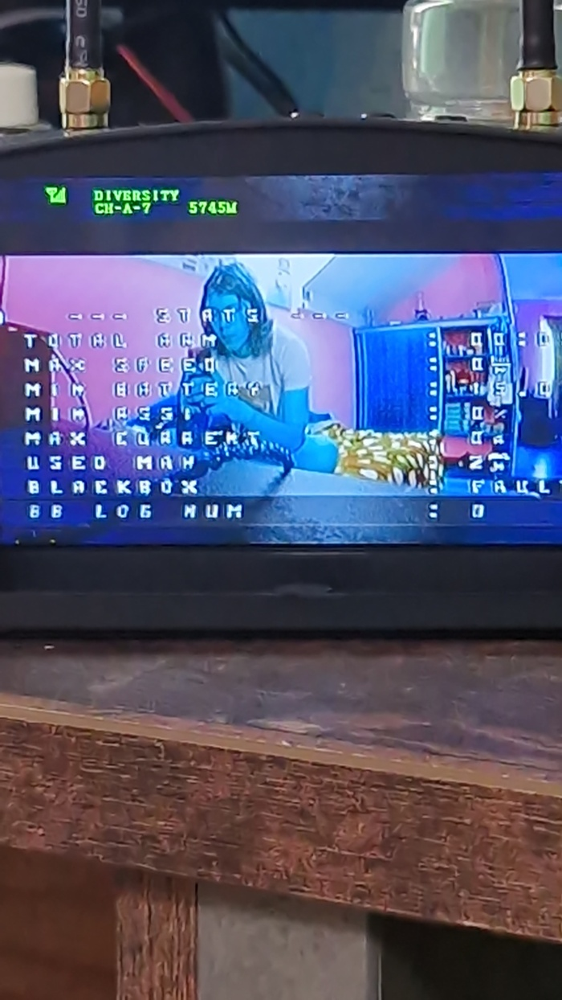
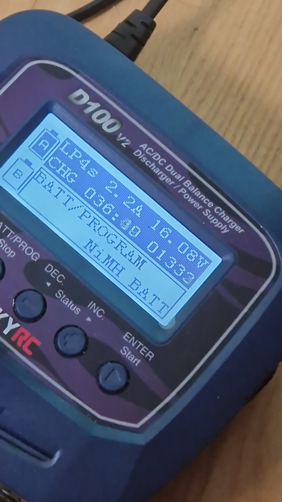
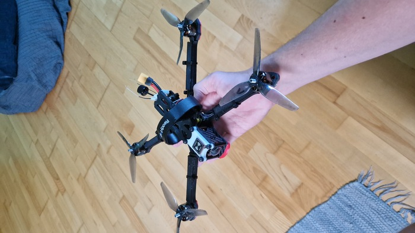
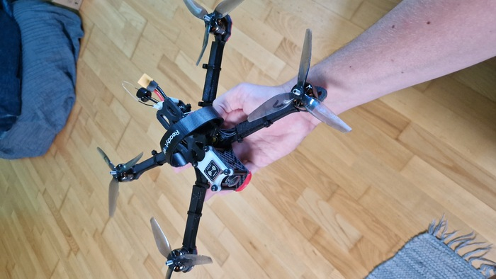
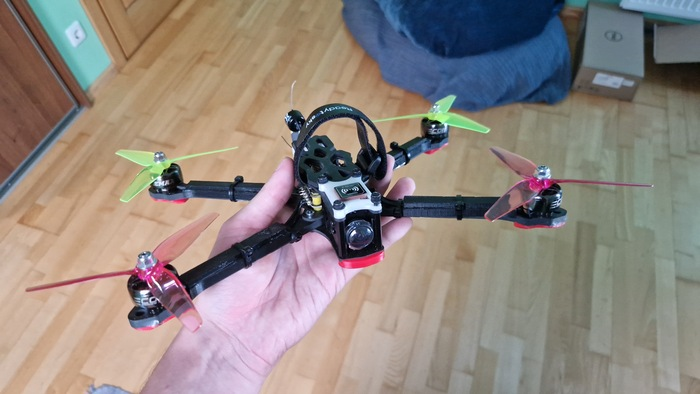
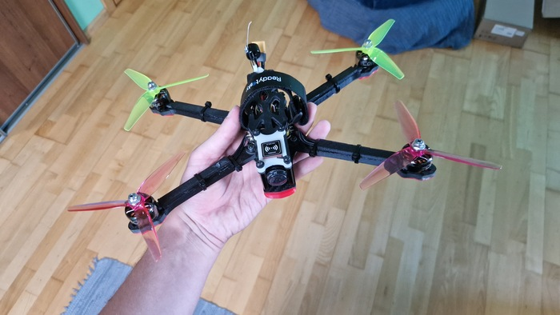
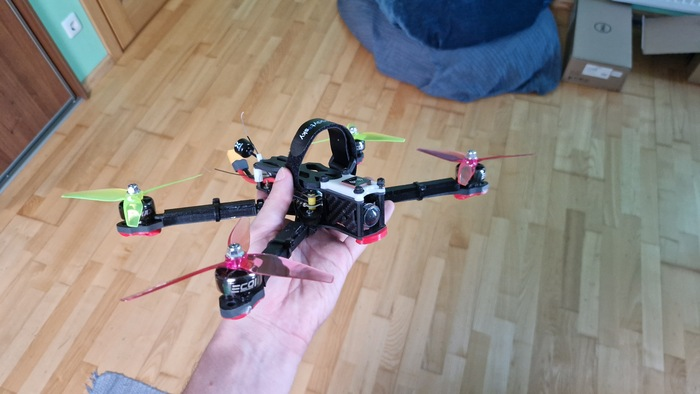
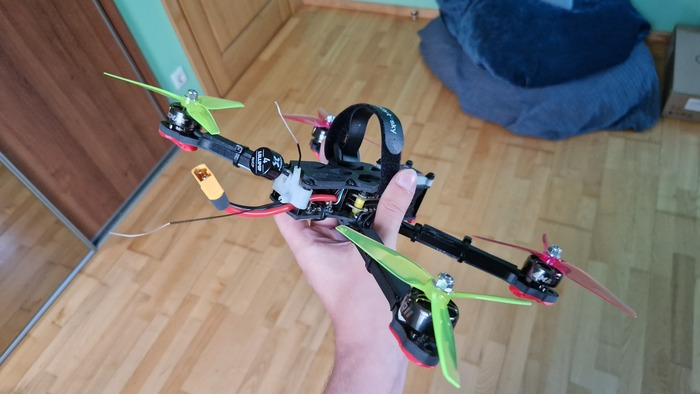
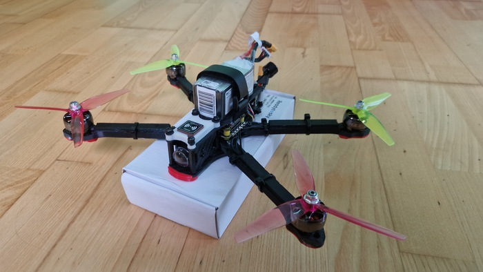

<video width="400" height="auto" controls>
  <source src="/assets/fpv-drone/1.mp4" type="video/mp4">
</video>

