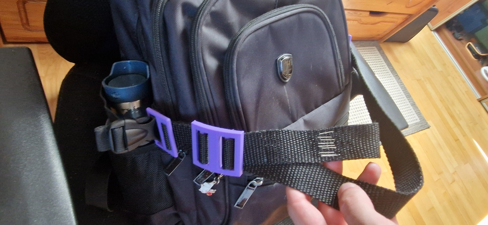

| Year |  Status   |
| :--: | :-------: |
| 2025 | Completed |

## Random FPV mods

There have been a few mini mods that I’ve done that are too minor to write about individually, so I decided to compile them here.

## Goggles battery ON/OFF button mod

The ON/OFF button on my FPV goggles (Eachine EV800D) works like a logic button—it sends a signal to turn the system on or off, but it doesn't physically cut power from the battery.
So when the goggles freeze or crash, the button stops responding, and there's no way to force a shutdown since the battery is still connected and supplying power.
The only way to turn them off is to either let them run out of juice or unplug the battery and plug it back in.
But unscrewing the whole thing takes time, so I made a hole and added a toggle button that lets me disconnect the battery.
This mod is the simplest mod you can do, but it saves a lot of time.

## Goggles external battery mod

The button lasted only so long before I decided I wanted an external battery.
The goggles' charger kind of sucks, so I wanted to be able to charge using my main FPV battery charger.
I made a 2x18650 battery holder with an XT30 connector.
For the goggles, I removed the battery, removed the button mod, and connected the power input to an XT30 connector as well.
I routed the wire through the hole that was originally made for the button.
I also made an adapter for my charger, so I can charge a single 18650 battery.

## Non-electronic mods

These are kind of basic, but I’ve also made two other changes.
One was removing the original strap from the goggles and replacing it with a DJI strap.
The original strap was very weak and would slip off my head a lot.
The second change was adding a strap to my backpack to tie the drone to.
Special backpacks for FPV drones have this feature, but I didn’t want to buy a new bag just for the drone.
It’s basically just a rope tied to my backpack, but I modeled and 3D printed the parts that make the strap adjustable.

## The Pictures

