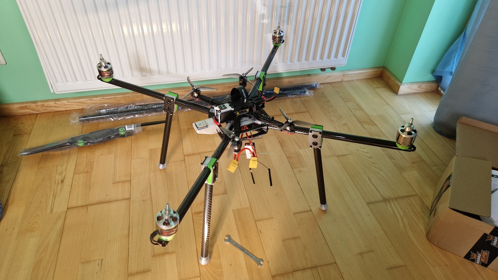

| Year |   Status   |
| :--: | :--------: |
| 2023 | Incomplete |

## Big drone

This project is not complete and I will not be working on it anymore.
I wanted to write about it just to show that I worked on this project even if I did not finish it.
This project was started by another person who gave it up after some time.
This quadcopter needed to be stable and for it to have autonomous capabilities.
There was a problem that the quadcopter would flip upsidedown everytime it was armed.
So I took it upon myself to fix it.
I managed to make it not flip upside down when armed, but I did not configure its autonomous capabilities.
In the end, I did not have enough time for it, so I gave it back.

## The Pictures

<video width="600" height="auto" controls>
  <source src="/assets/heavy-lift-quadcopter/1.mp4" type="video/mp4">
</video>

<video width="600" height="auto" controls>
  <source src="/assets/heavy-lift-quadcopter/2.mp4" type="video/mp4">
</video>

