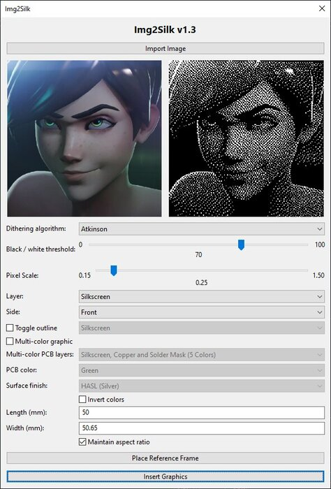
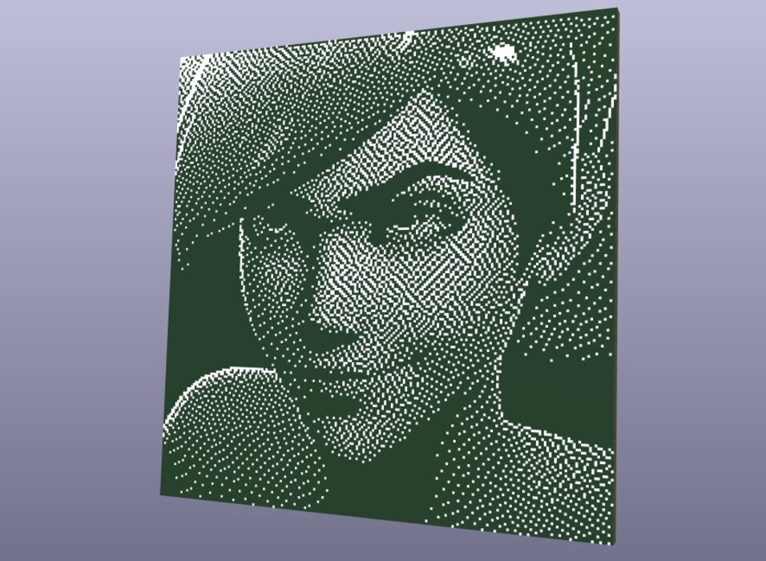
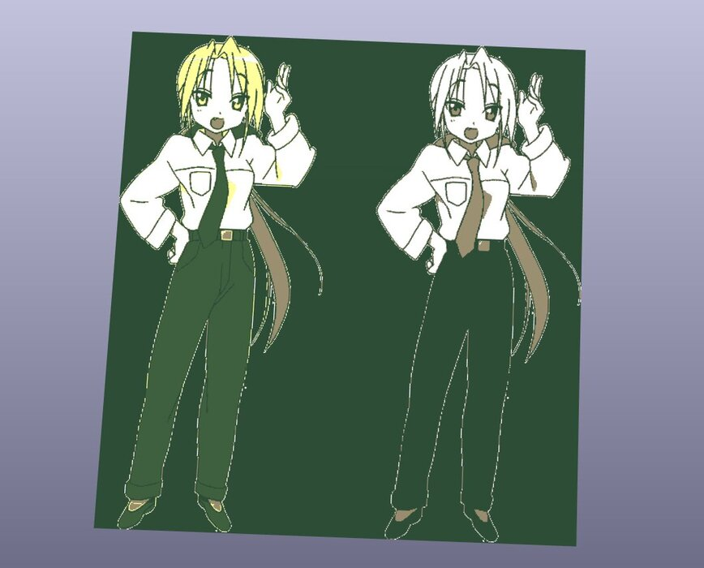

| Year |  Status   |
|:----:|:---------:|
| 2026 | Completed |

## The Problem

KiCad’s built-in Image Converter requires a tedious multistep workflow.
Adjusting scaling or contrast means opening an external utility, tweaking threshold parameters, exporting a standalone footprint file, and re-importing it into the editor.
This creates a cycle you have to repeat from scratch for every minor edit.

## The Solution

I built Img2Silk to bring flexible, high-fidelity image processing directly into KiCad's PCB Editor via Python and pcbnew.
It supports classic dithering algorithms like Floyd, Steinberg, Atkinson, and Bayer for smooth gradients.
It also features multicolor rendering that uses the board's own physical layers, including silkscreen, solder mask, exposed copper, and substrate, as a palette.
You can find the source code on [my GitHub](https://github.com/NBalciunas/kicad-img2silk).

## Pictures

