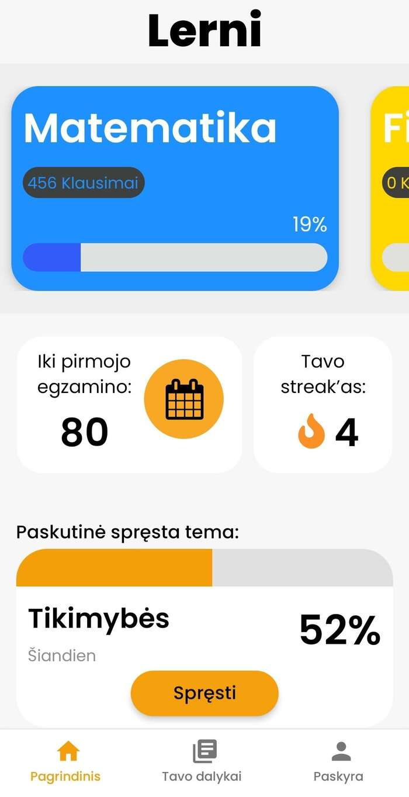
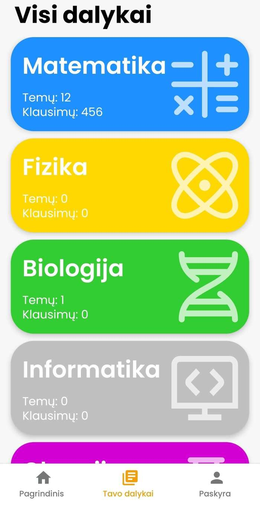
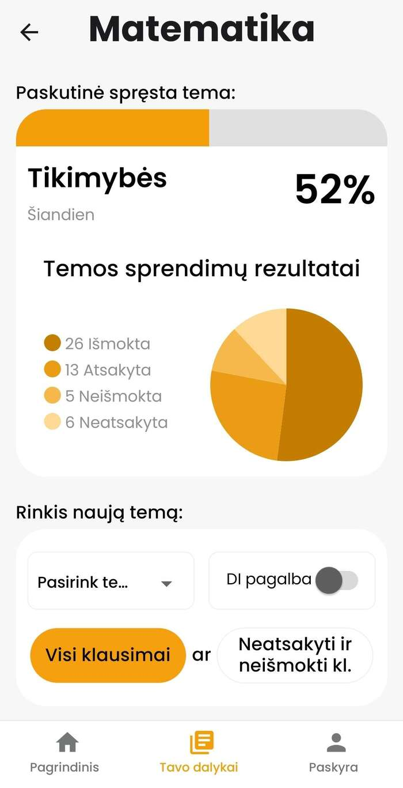

| Year | Status  |
| :--: | :-----: |
| 2025 | Ongoing |

## Teamwork makes the dream work

I will begin by saying that this is not a solo project.
The app was made by me and my friend who studies software engineering.
We cooked it up in a hackathon "Hack4Vilnius", where we won second place with it.
We did not stop working on it and continued for a few months.
The app went through a lot of changes, and we went into beta testing on Google Play.
After completing beta testing, it was launched and right now is available for download in Google Play.
Some time later we went to another hackathon "Tech_Champ", where we presented it and won third place.
If we do not stop working on it, we will probably try to launch it on App Store as well.

## Challenges

It was fascinating working on a project like this.
When working on an app you often only think about the programming aspect of it.
But there is so much more than just programing, like marketing, beta testing, UI/UX, legalities and much more.
It was really educational launching an app for the first time and seeing all the steps that you need to take to launch an app.

## Links

If you are interested you can visit Lerni socials or if you have an Android, download the app and try it out.

#### Website : [lerni.lt](https://lerni.lt/)

#### Facebook : [Lerni Facebook](https://www.facebook.com/profile.php?id=61572529424141)

#### Instagram : [Lerni Instagram](https://www.instagram.com/lerniltapp/)

#### Google Play : [Lerni Google Play](https://play.google.com/store/apps/details?id=com.cogi.lerni)

## Pictures

