| Year |  Status   |
| :--: | :-------: |
| 2025 | Completed |

## Product Development Project

This study year (2024–2025), I had the opportunity to join Aalto University’s Product Development Project (PdP) course.
From my university, VILNIUS TECH, only five students were selected, and I was lucky to be one of them.
At the start, we had to choose a project and compete for it among other teams.
We managed to secure the most popular challenge — the Saab Mine Detection Project, which immediately stood out as an exciting and meaningful task for our team.

## Teamwork

Since our team was one of the larger groups in the course, we split into smaller sub-teams.
I was part of the telemetry team, which focused on the drone itself—its communication, flight systems, and onboard data handling.
Although we faced several challenges along the way, including damage to the prototype, I believe the research and development we carried out was highly valuable and contributed meaningfully to the overall project.

## End result

By the end of the course, our team delivered a working prototype of the mine detection drone, featuring a modular design, a functioning telemetry system, and integrated sensor components.
While some parts were still in active development, we successfully demonstrated key features during the final Gala at Aalto University. Our efforts were recognized with the highest possible grade (5), which reflected both the technical depth and teamwork behind the project.
Beyond the engineering work, this experience taught us how to collaborate internationally, adapt to challenges, and deliver results under real-world constraints.

## The Pictures

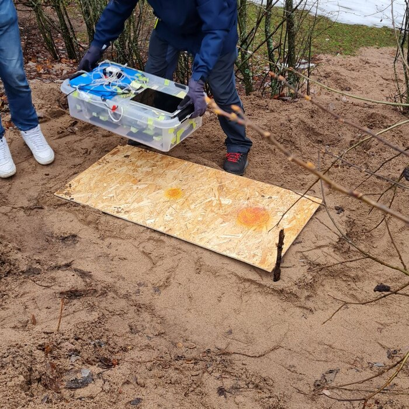  
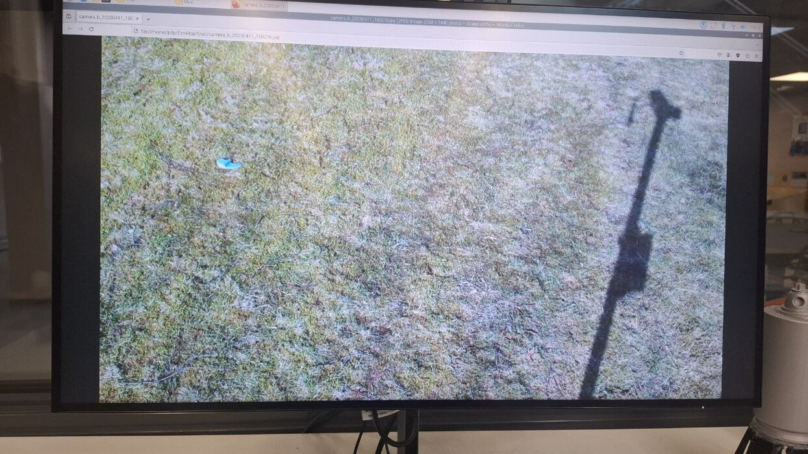  
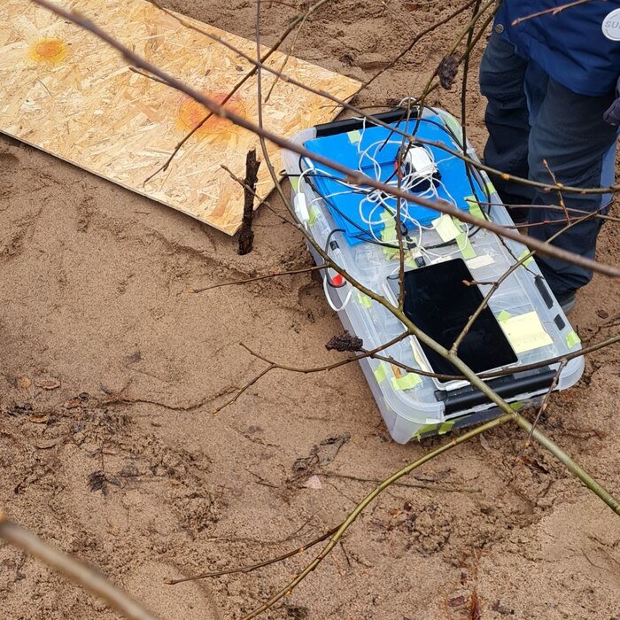  
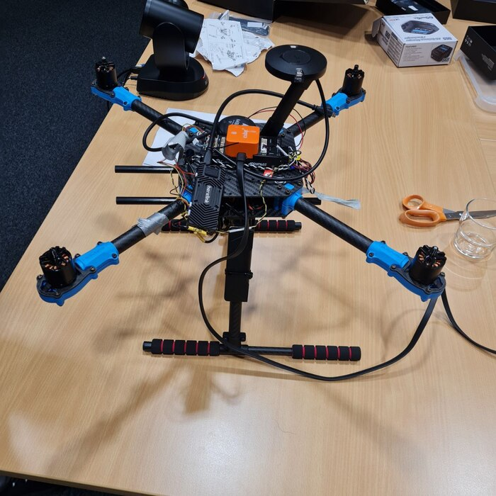  
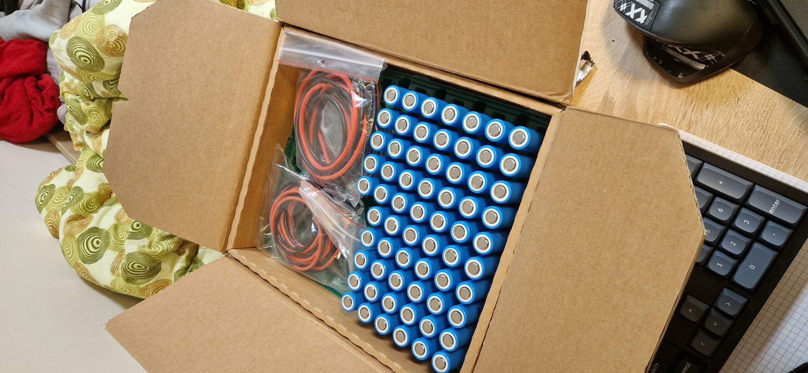  
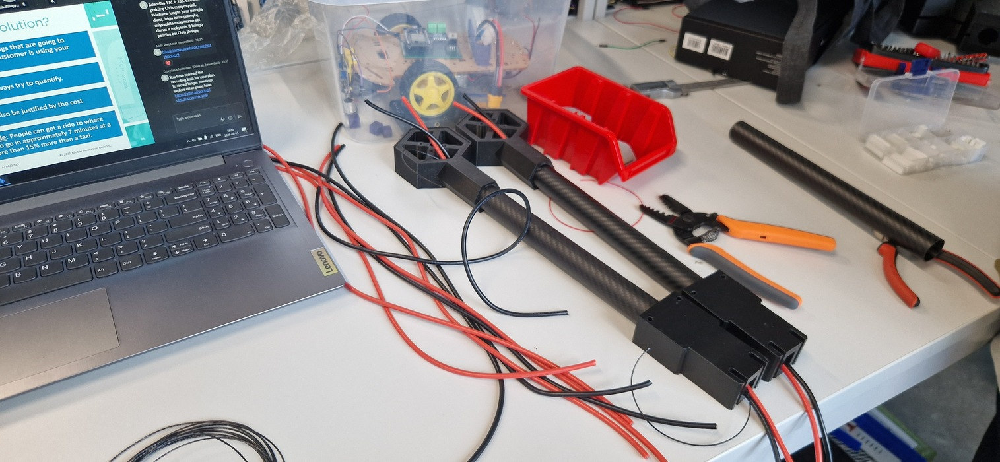  
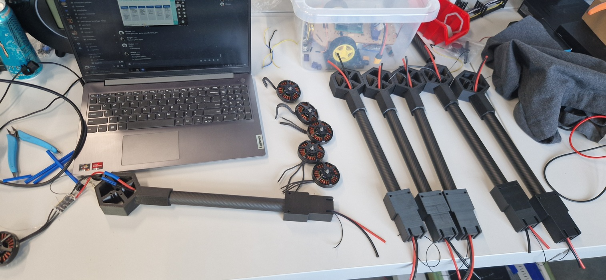  
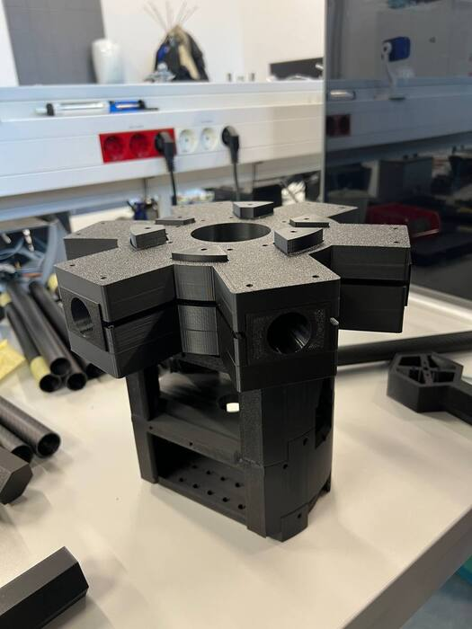  
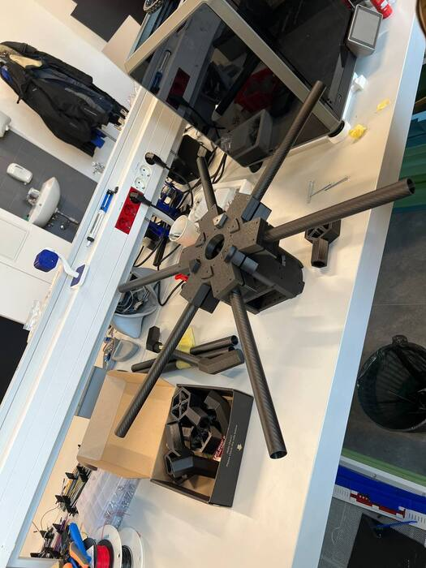  
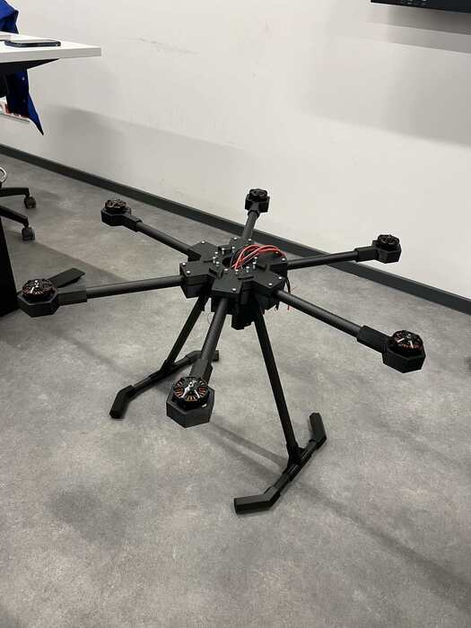  
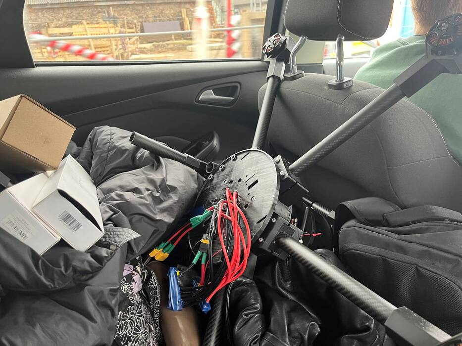  
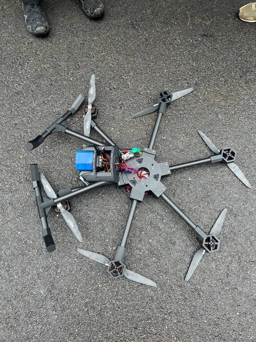  
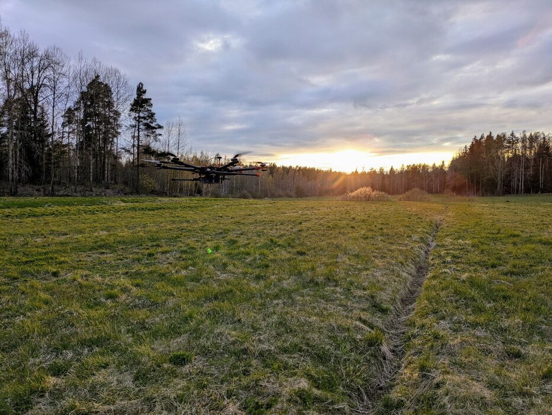  
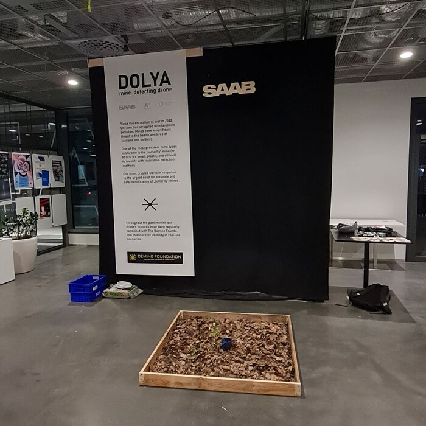  
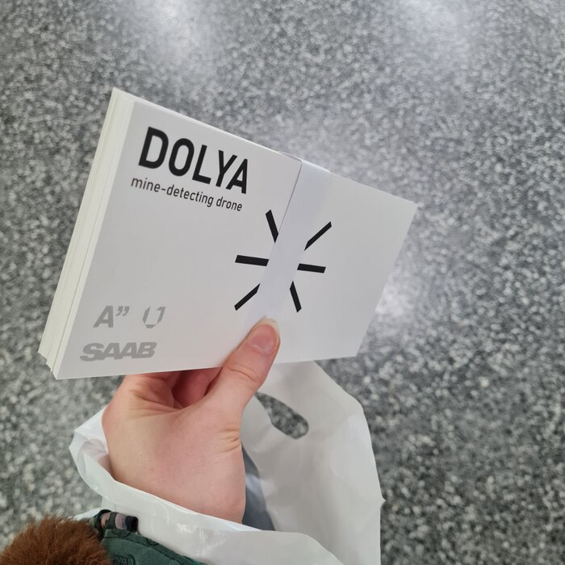  
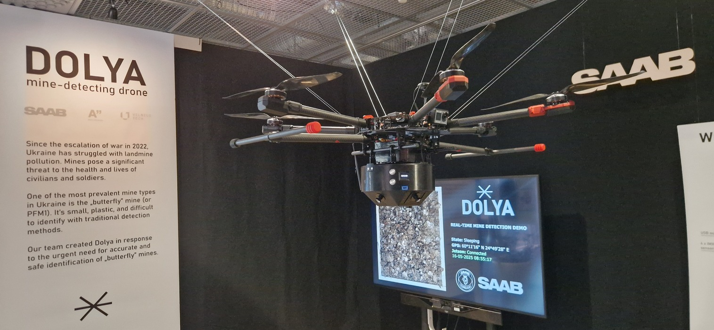  
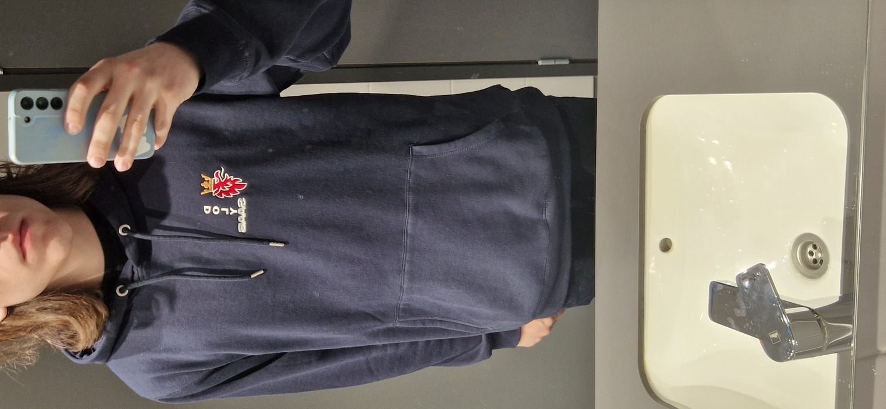  
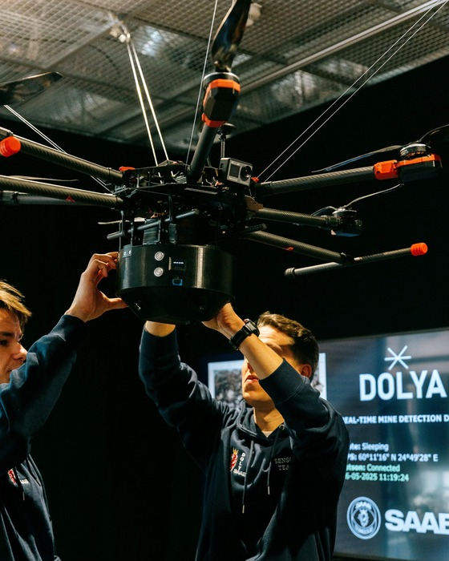  
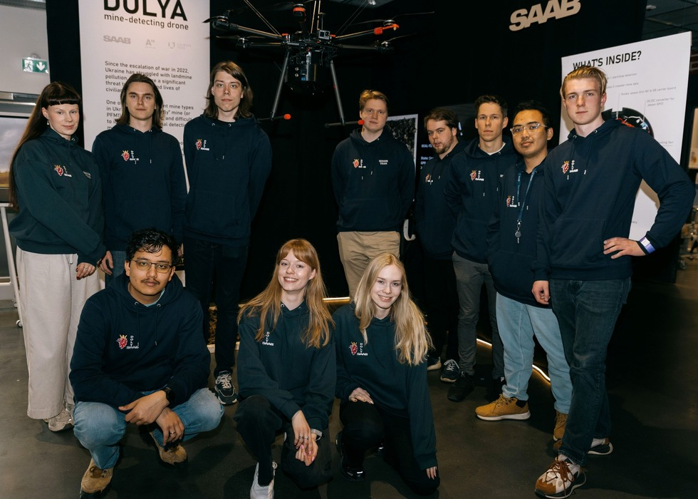
