| Year |  Status   |
|:----:|:---------:|
| 2024 | Completed |

## Another gift

My friends birthday was coming up and I wanted to make him something.
Since I started dipping my feet into the world of custom keyboard I decided to make a simple 4x4 keypad.
For its brains I chose the lovely Raspberry Pi Pico.
For the buttons I used Gateron Milky Yellow Pro switches and keycaps from an old keyboard.
Furthermore, I also added neopixel LEDs to add some nice lights.
For the code I used KMK firmware which supported everything I wanted to add and more.
Sadly, I made a mistake by choosing bad diodes and because of this I just bridged the diodes instead of using bad ones.
In the future I would need to pay more attention to picking the right diodes.
To make everything more tidy I 3D printed a case and put everything together.
The name is a nod to a keyboard I designed a while ago that I did not put together called [Dachshund104](https://github.com/NBalciunas/Dachshund104).
The mistake in the name is also by design.
All in all the project came together quite nicely.

## Pictures

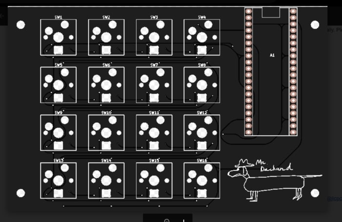
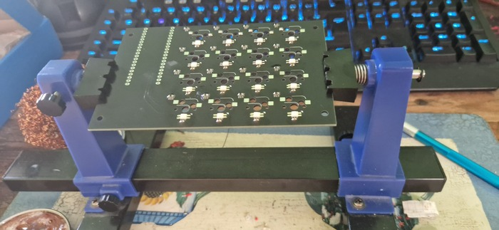
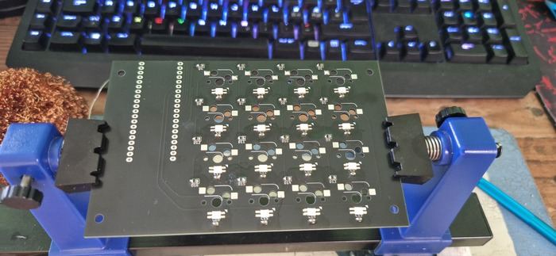
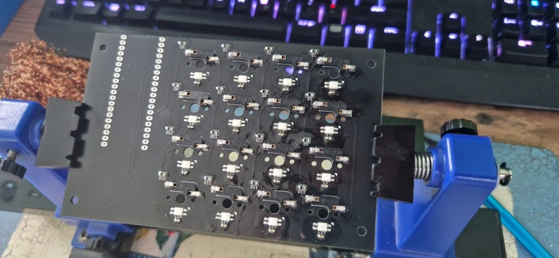
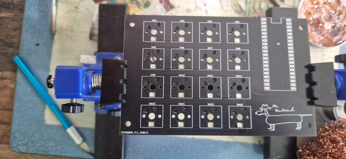
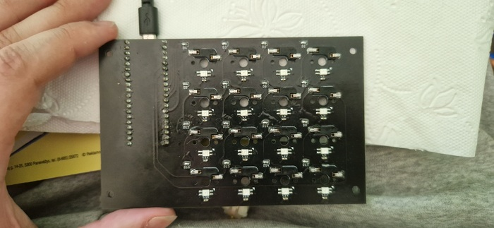
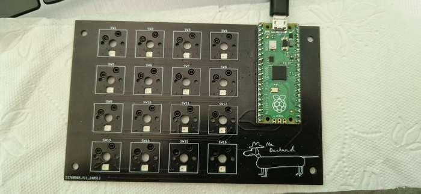
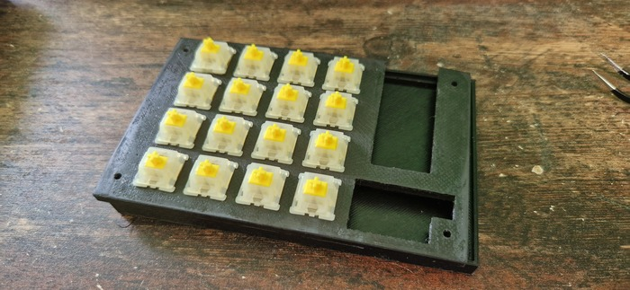
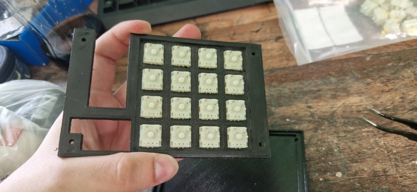
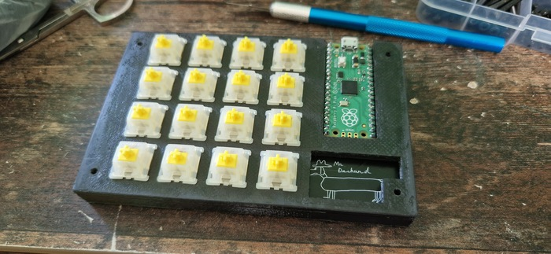
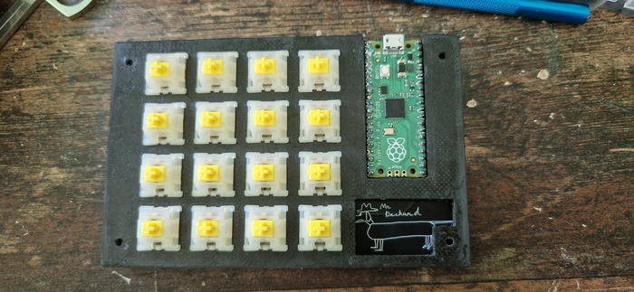
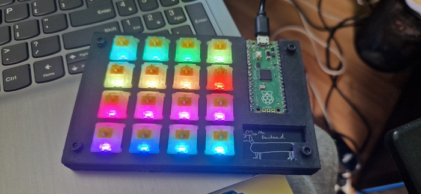
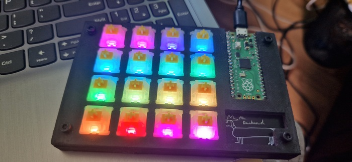
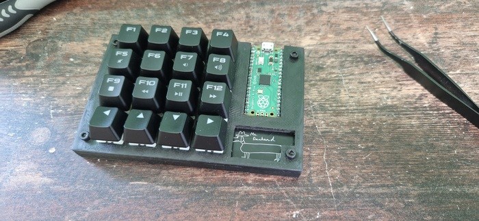
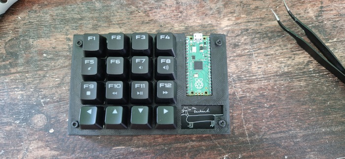
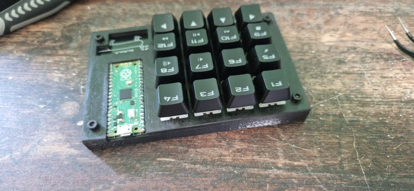
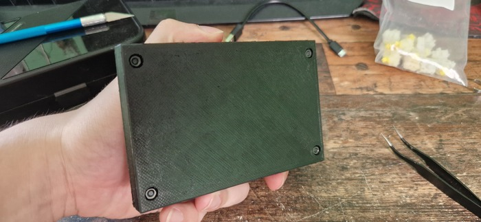
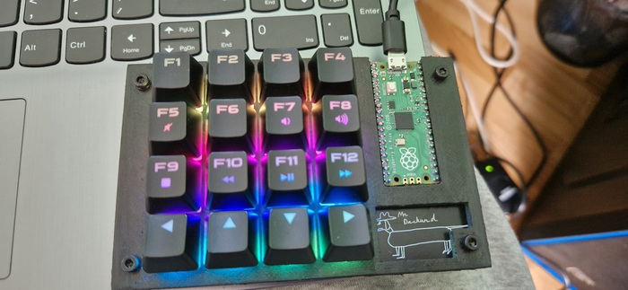

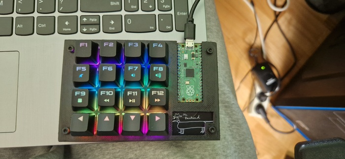
