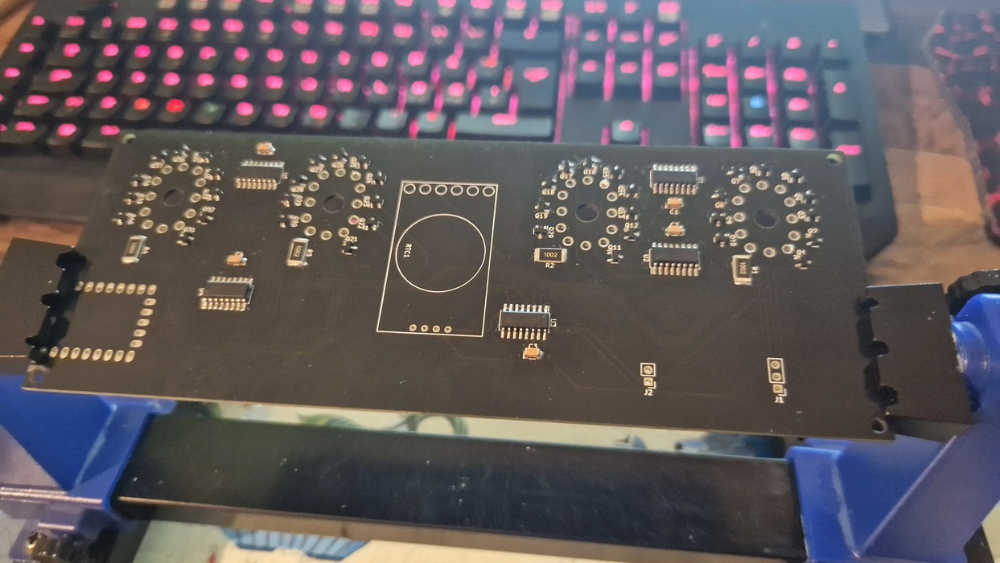

| Year |  Status   |
|:----:|:---------:|
| 2023 | Completed |

## A nice birthday gift

placeholder pls be patient

## The Pictures

<video width="400" height="auto" controls>
  <source src="/src/assets/images/nixie-clock-mk2/1.mp4" type="video/mp4">
</video>

<video width="400" height="auto" controls>
  <source src="/src/assets/images/nixie-clock-mk2/2.mp4" type="video/mp4">
</video>

<video width="400" height="auto" controls>
  <source src="/src/assets/images/nixie-clock-mk2/3.mp4" type="video/mp4">
</video>

