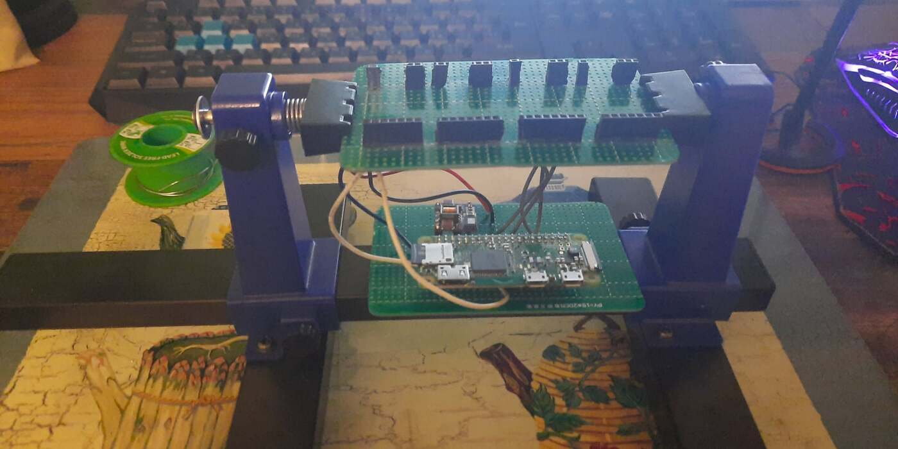

| Year |  Status   |
| :--: | :-------: |
| 2021 | Completed |

## My first project

This was my first serious project that I made.
I found out about nixie tubes from an anime called "Steins;Gate".
Ever since finding about those lamps I fell in love with their aesthetic.
I wanted to make something with them, so I decided to make a clock.

## The brains

For it's brains I picked out a Raspberry Pi Zero W and I wrote the code in Python.
It is a bit overkill to use a Raspberry Pi for just a clock, but again it was my first project, so you will have to excuse me.
I did later down the line found some other programs to run continuously on the Pi that I will write about later.

## Nixie drivers

For the nixie drivers I used [exixe-14](https://github.com/dekuNukem/exixe) nixie tube driver modules.
They're pretty great for projects like these, but in the future I would make the drivers myself or use cheaper ones.

## High voltage

To power nixie tubes you need 170 volts.
Since I wanted to power my clock with 5 volts through USB I needed a high voltage power supply that would step up my 5 volts to 170 volts.
I chose to use [NCH8200HV](https://omnixie.com/products/nch8200hv-nixie-hv-power-module) power converter.
It worked fantastic and produced no noise.

## Connecting everything together

I'll repeat myself one more time and say that it was my first project.
Because of that I wasn't yet familiar with making PCBs, so I connected everything a bit strangely.
I cut out two pieces of perfboard and connected them together, effectively creating what could be considered a 4-layer circuit board.
When I soldered everything together, 3D printed a case and put everything together.

## Making the tubes last longer

These tubes have a tendency to wither out if not properly used.
If a number is glowing very long it damages the other ones.
To negate this effect and make the tubes last longer I wrote a simple function to cycle all the number every 20 minutes for a few minutes.

## Putting Raspberry's power to good use

As I have said before the Raspberry is a bit too much for just a clock.
Because of that I have found ways to make good use of that excess power.
One of them is hosting Pi-hole, a network-wide ad blocker.
Another thing you can do is host a discord bot or a few at the same time.

## Pictures

