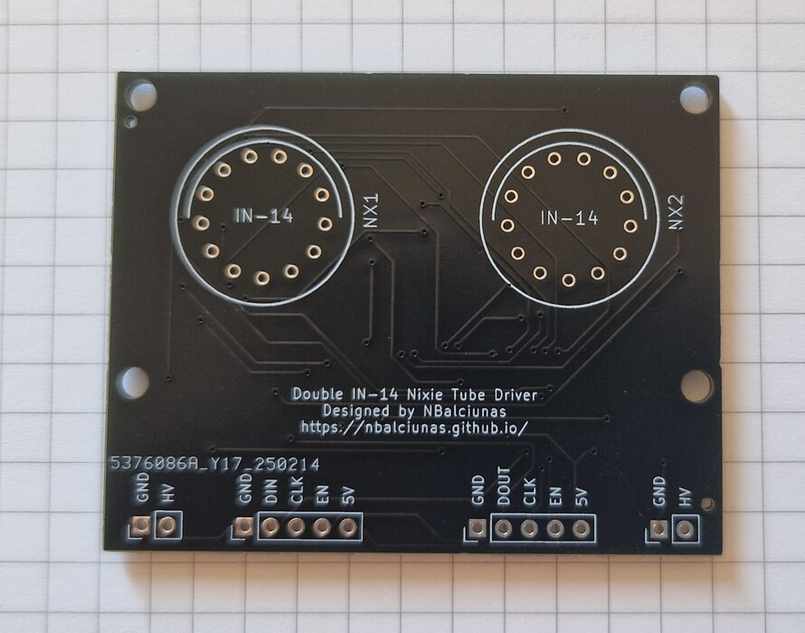
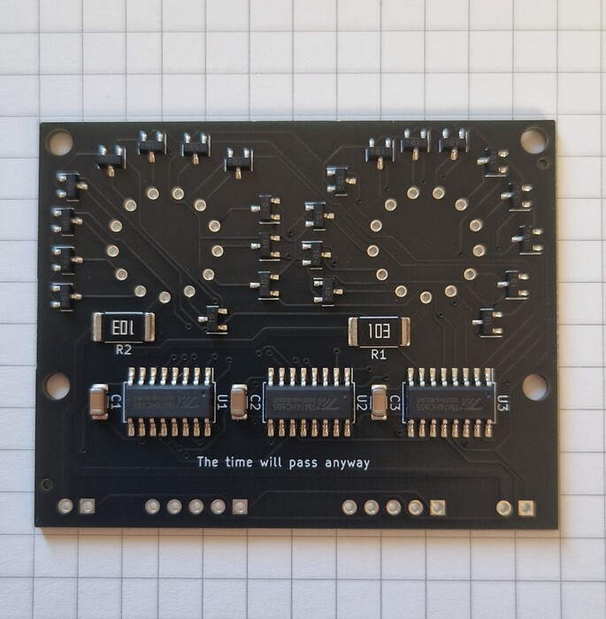
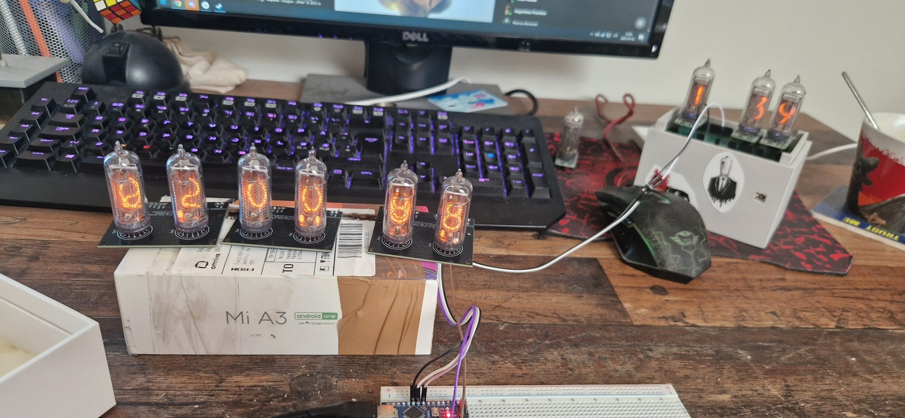
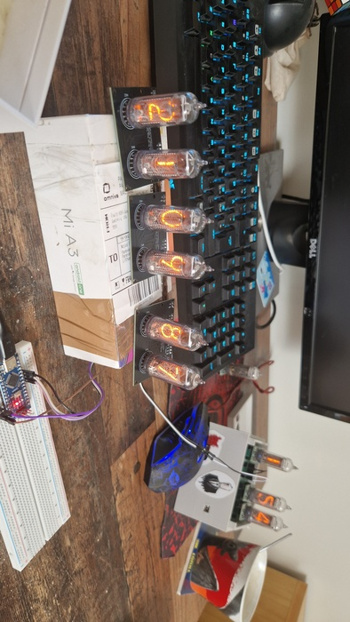

|   Year    |  Status   |
| :-------: | :-------: |
| 2024/2025 | Completed |

## A driver of my own

After building a few Nixie clocks, I decided to design my own driver board.
The design is simple, cost-effective, and easy to assemble.
The code for it is straightforward to write, making the whole process smooth and efficient.
One of the standout features of this driver is that it’s daisy-chainable, allowing you to easily connect multiple Nixie tubes in a series without additional complexity.
It turned out rather nice.

## Update

This was originally only an IN-12 driver, but now I've also made IN-14 drivers.
The idea is the same. From a technical standpoint, the only difference—aside from the footprint—is that the IN-14 has an extra dot, and therefore an extra pin.
But that works out fine, because in the IN-12 driver there are two leftover pins in the shift registers that need to be skipped over in code.
The final note is that these are for sale on [my Tindie](https://www.tindie.com/stores/nbalciunas/), so if you're ever looking for Nixie drivers, consider buying a few.

## The Pictures

