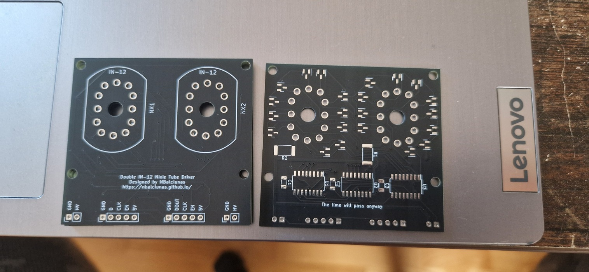
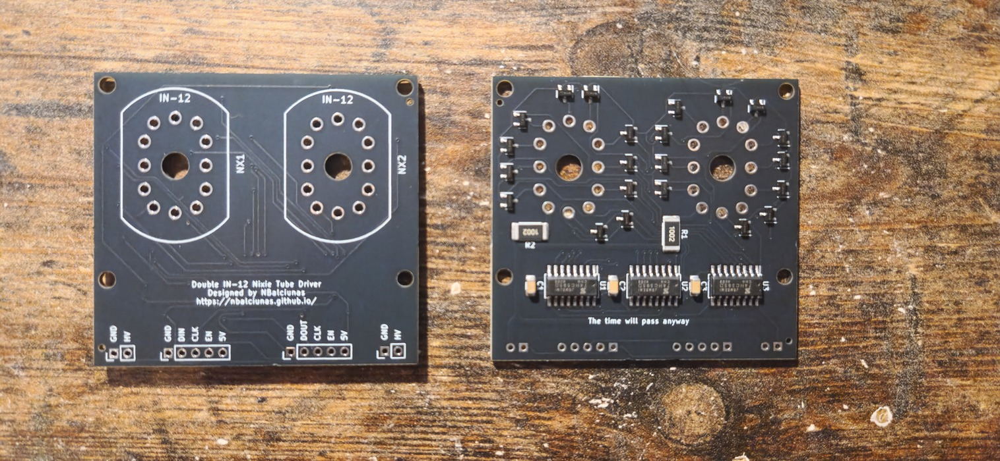
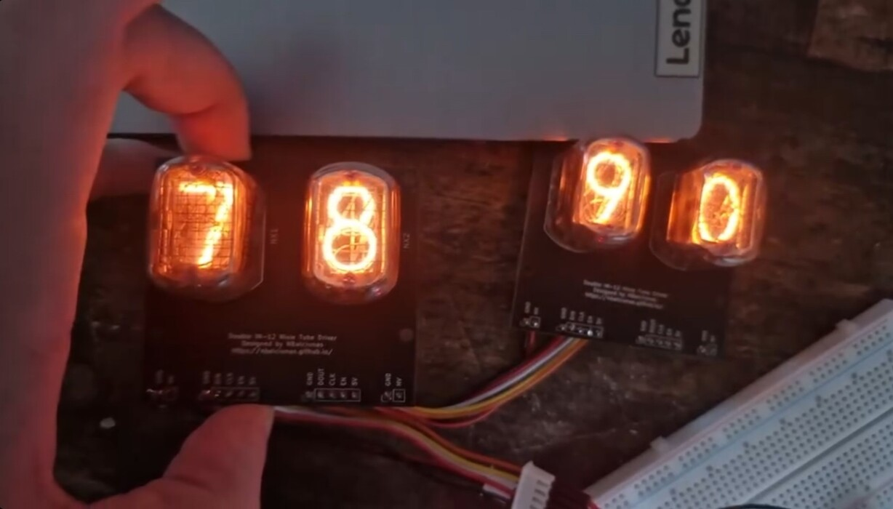

| Year |  Status   |
|:----:|:---------:|
| 2024 | Completed |

## A driver of my own

After building a few Nixie clocks, I decided to design my own driver board.
The design is simple, cost-effective, and easy to assemble.
The code for it is straightforward to write, making the whole process smooth and efficient.
One of the standout features of this driver is that it’s daisy-chainable, allowing you to easily connect multiple Nixie tubes in a series without additional complexity.
It turned out rather nice.

## The Pictures

