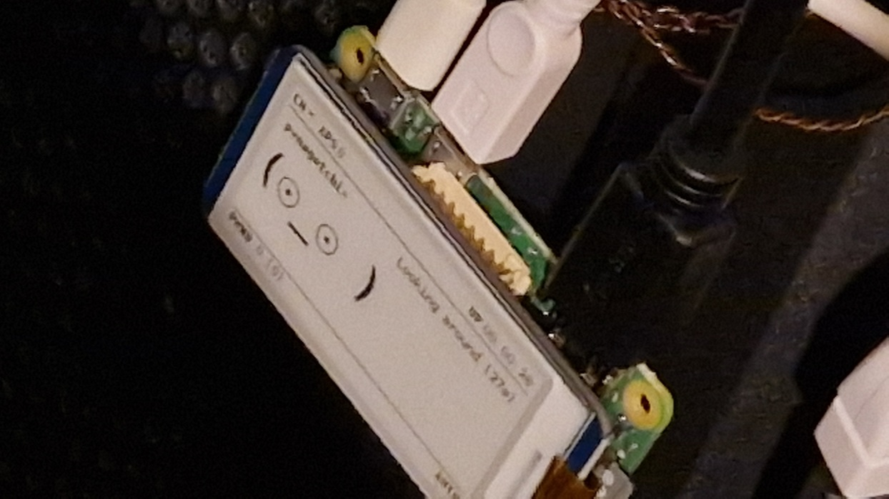

| Year |  Status   |
|:----:|:---------:|
| 2024 | Completed |

## A cool gadget

For a long time I wanted to make a [pwnagotchi](https://pwnagotchi.ai/).
For those who do not know, a pwnagotchi is a Raspberry Pi Zero W based project.
It has an AI that learns with time, and its main goal is to capture Wi-Fi handshakes.
I chose to make my pwnagotchi with a Raspberry Pi Zero 2 W because it is a newer model.
Though the older model is more supported.
Besides the brains it also needs a battery and a screen and for those I chose Pisugar 3 and a 2.13 inch Waveshare E-Ink display HAT respectively.
I used the Jayofelony's image because it supports Raspberry Pi Zero 2 W.
For the case I bought a 3D printed case from JLC3DP printing services.
I customized it to look nicer and show more information with plugins.
In the end it ended up looking very cute.

## The Pictures

