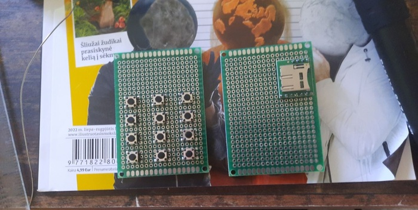
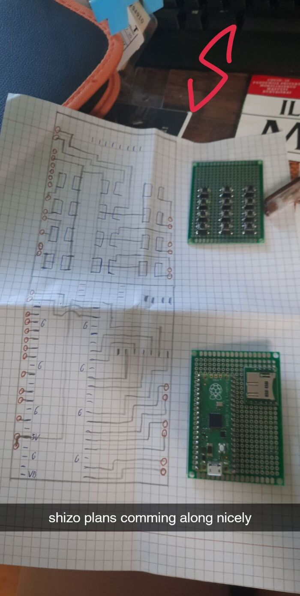
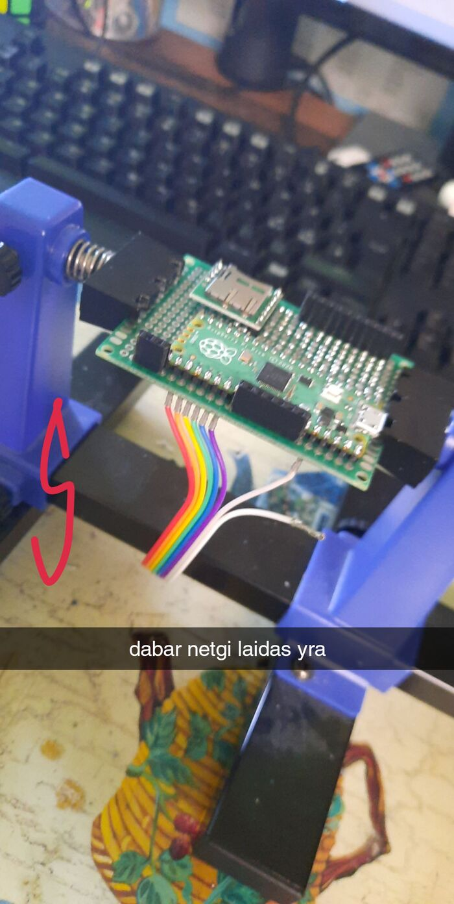
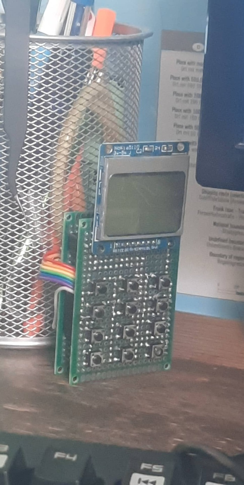
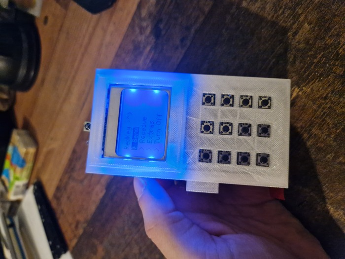
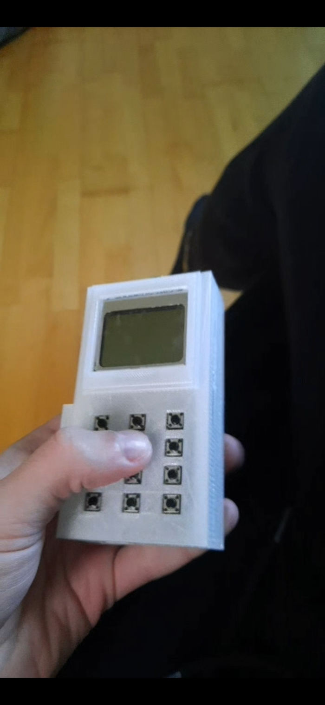
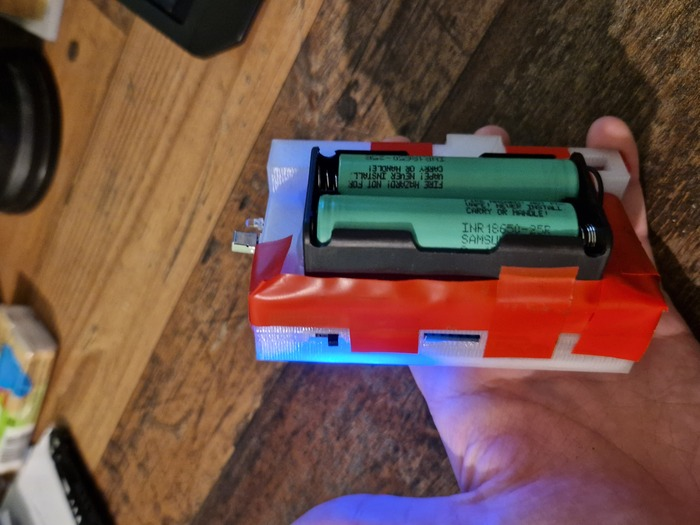
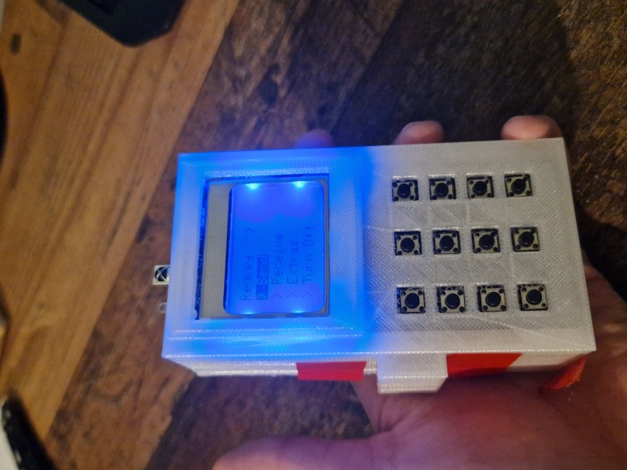

| Year |  Status   |
| :--: | :-------: |
| 2022 | Completed |

## The idea

When making my nixie clock I thought that it would be a nice addition to add an option to control the clock with an infrared remote.
So I ordered IR receiver and IR remote.
I when proceeded to short the IR receiver thus breaking it.
I ordered a new set and I had to wait, but in the meant time I discovered that in the kit that I ordered also came an IR LED.
I hooked it up and tested it out and had an idea to create an infrared remote.

## Controlling the invincible lights

Infrared signals can be a little bit hard to grasp at first, but at their core they are just ones and zeroes.
In my code I used hexadecimals to make the signals more understandable for me.
Besides the IR LED I also needed some other basic parts.
I settled on Raspberry Pi Pico microcontroller since it had everything I needed.
To give it some memory I also added a SD card.
To also be able to receive signals I added an IR receiver.
And lastly to be able to have a little UI and make the project handheld I added a little screen, some buttons and a battery.
The rest that was left was to code everything together.
I used C and my code ended up very tangled up, but it worked.
I managed to receive signals, save them on the SD card, view them on the screen, pick one out and emulate it with my own IR LED.
The project was a success and I learned a lot while making my remote.

## The name

For those wondering what "RedKey" means, let me break it down for you.
I wanted to name my project something cool for the style factor.
"RedKey" is two words mashed together.
Infra**RED** and skeleton **KEY**.
A skeleton key is a key that opens all doors and the remote is infrared, so It is pretty much self-explanatory why I picked these words.
Also, I needed my name to be short, so It could fit in the top line of the screen.
If I did not need that requirement maybe the name would have ended up different.

## The Pictures

<video width="600" height="auto" controls>
  <source src="/assets/redkey/1.mp4" type="video/mp4">
</video>

