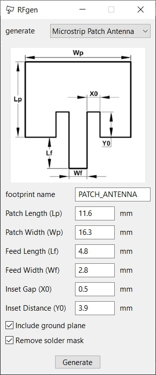
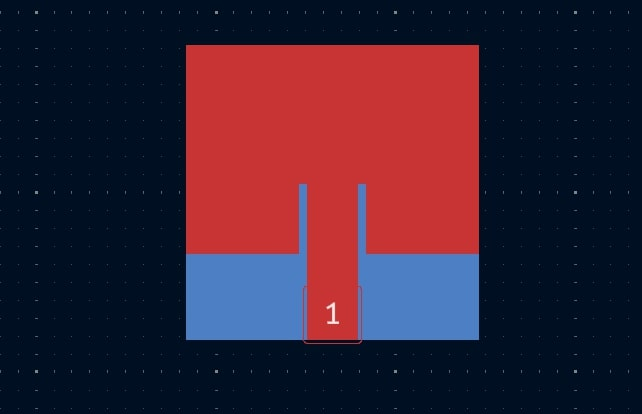
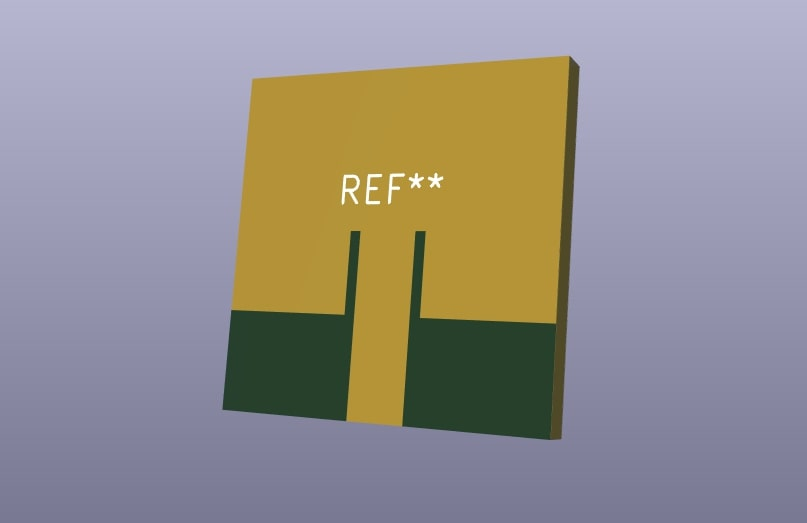

| Year |  Status   |
| :--: | :-------: |
| 2025 | Completed |

## Open Subject Project

During my Erasmus+ Exchange semester at Windesheim University of Applied Sciences, I needed to complete a one-credit Open Subject.
Since I’m an avid KiCad user, I decided to spend that credit learning how to program KiCad plugins.
I chose to create an RF generation tool because earlier that summer I had worked on [5.8 GHz patch antenna arrays](https://nbalciunas.github.io/posts/5.8ghz-antenna/), and that experience showed me how repetitive and time-consuming RF geometry creation can be.
The plugin was written in Python using KiCad’s "pcbnew" scripting library.
Building this plugin became a natural extension of that work, a tool that would genuinely help me if I return to RF design in the future (and I fully plan to).
It was a fun project, and I intend to keep expanding it.
Right now it can generate patch antennas and Wilkinson power dividers with custom parameters, but I plan to add more functionality over time.
If you are interested, you can find this project on [my GitHub](https://github.com/NBalciunas/kicad-rfgen).

## Pictures

