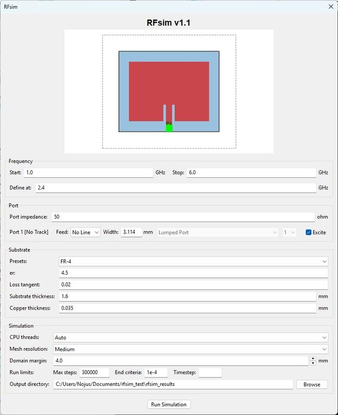
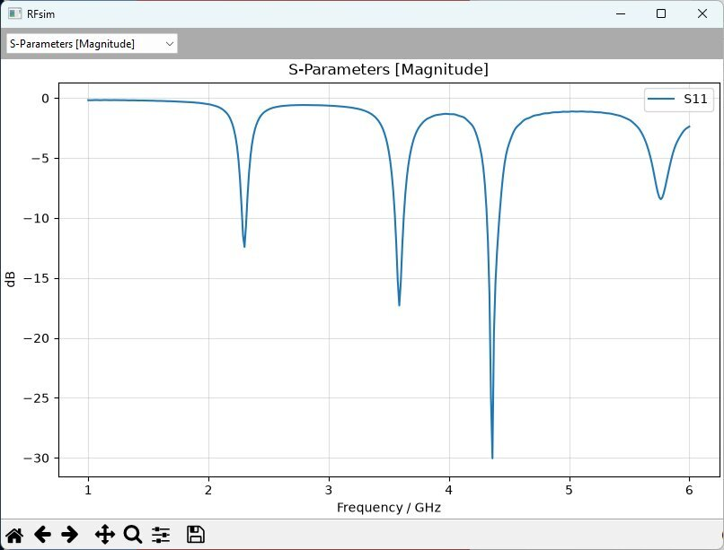
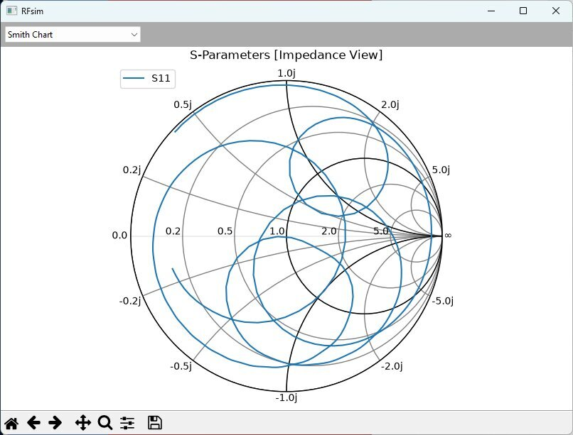
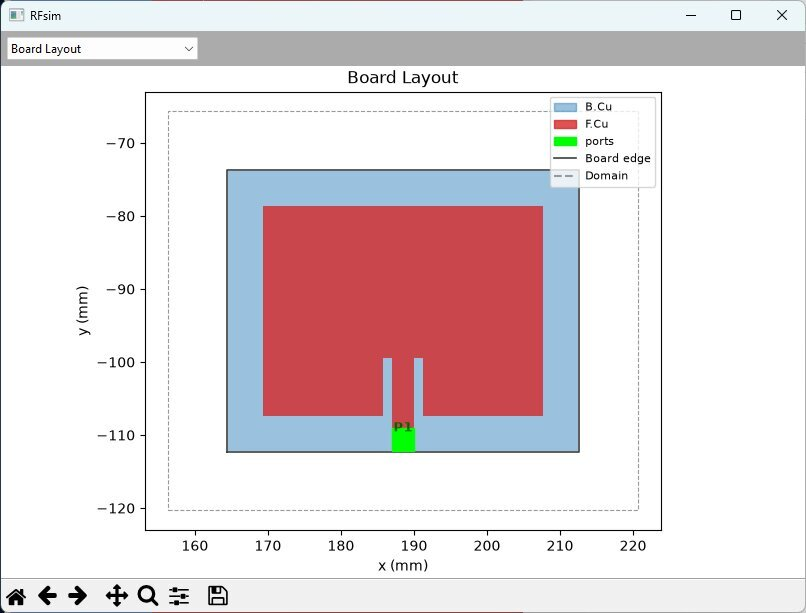
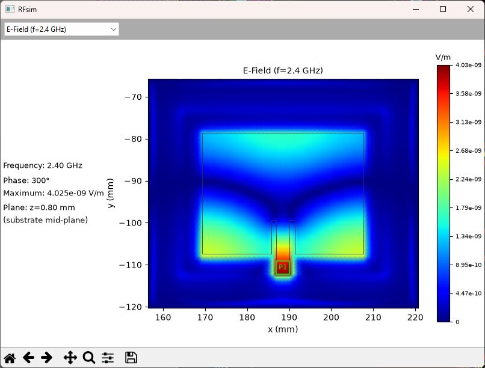
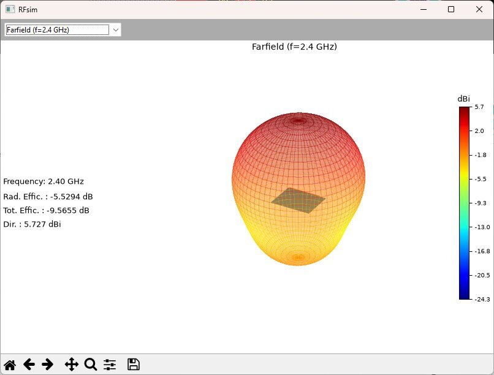

| Year | Status  |
|:----:|:-------:|
| 2026 | Ongoing |

## CST workflow frustrations

This project started as a quick experiment to see if I could hook openEMS directly into KiCad.
My main issue with tools like CST Studio Suite was always the layout loop.
Once you design an RF structure and verify it in CST, bringing it back into KiCad to add non-RF components is annoying and prone to export glitches.
The same goes for taking a KiCad board with mixed RF and regular circuits back into CST.

## Existing KiCad plugins

I tried using openEMS on its own and experimented with other KiCad simulation plugins, but setting up openEMS standalone was a total headache and the existing extensions just didn't work reliably for my workflow.
That pushed me to make something that solves the setup friction while staying completely inside KiCad.

## Geometry conversion

That solution is RFsim, a KiCad 10 plugin that connects the PCB editor directly to openEMS.
It is important to note that RFsim does not do any of the math itself.
Instead, it acts purely as a bridge that translates native KiCad layout items like pads, tracks, vias, arcs, and copper fills into CSXCAD primitives for openEMS to solve.
The plugin handles the simulation setup, runs the solver, and pulls back S-parameter sweeps, line impedance, 3D far-field radiation patterns, and component parasitics like ESL and ESR right into your workspace.

## Future plans

It started as a fun test, but it turned into something I actually use for mixed-signal and RF boards.
I plan to keep tweaking it and adding features over time.
If you want to try it out or take a look at the code, you can find it on [my GitHub](https://github.com/NBalciunas/kicad-rfsim).

## Pictures

