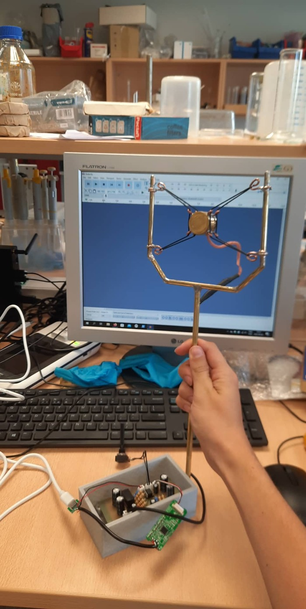

| Year |  Status   |
| :--: | :-------: |
| 2022 | Completed |

## The story

I was in need of a new microphone since my old one was bad and nearing its end of life.
I was suggested to build a microphone following [DIY Perks's video](https://www.youtube.com/watch?v=LoQu3XXIayc).
A lot of things I did according to the video, but there were a few changes I made to make it a bit different and I hope better.
First of all my microphone shape was different in hopes of making it easier to cut.
The reasoning for this is that dealing with metal was the hardest part of this project.
Making the shape a bit more angular made it easier to cut the strips of metal and solder them together.
By making the shape different it also lost the ability to rotate its axis.
One thing that I made more complex was the soldering.
Instead of using a perfboard I made a PCB and etched it at the lab.
Soldering all the components made it a bit simpler.
I also 3D printed some parts for the case to make it snap together a bit better.
In the end I was left with a high quality microphone.
There were some issues with the buzzing that could be improved but overall its quality far exceeds what I had before.

## Pictures

